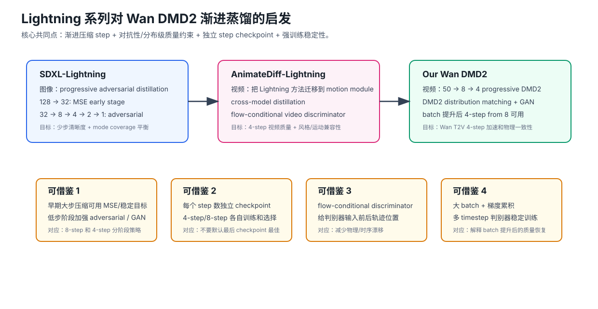

# ByteDance Lightning 系列报告：渐进式对抗扩散蒸馏对 Wan DMD2 的启发

日期：2026-06-29
关注论文：

1. Shanchuan Lin, Anran Wang, Xiao Yang. [SDXL-Lightning: Progressive Adversarial Diffusion Distillation](https://arxiv.org/abs/2402.13929), arXiv 2024-02, ByteDance.
2. Shanchuan Lin, Xiao Yang. [AnimateDiff-Lightning: Cross-Model Diffusion Distillation](https://arxiv.org/abs/2403.12706), arXiv 2024-03, ByteDance.

## 1. 核心结论

这两项工作和我们的项目高度匹配。它们提供了一个比单纯 Progressive Distillation 更贴近我们当前实验的证据链：

```text
Progressive Distillation
    -> Progressive Adversarial Diffusion Distillation
    -> Video Progressive Adversarial Distillation
    -> Wan T2V DMD2 50 -> 8 -> 4
```

SDXL-Lightning 的关键点是：**progressive distillation 负责保持原模型 probability flow 和 mode coverage，adversarial loss 负责解决少步 MSE 蒸馏变糊的问题。**

AnimateDiff-Lightning 的关键点是：**这套 progressive adversarial distillation 可以迁移到视频模态，并且视频场景需要额外考虑 motion module、base model 兼容性、video discriminator 和大 batch 稳定训练。**

对我们最直接的启发是：

- 我们当前 `50 -> 8 -> 4` 是合理的 progressive route。
- 4-step/8-step 应该作为不同部署模型分别训练和选择，而不是期待一个 checkpoint 适配所有 step。
- 少步模糊不是偶然，SDXL-Lightning 也明确指出 MSE progressive distillation 在 8 step 以下会变糊。
- 对抗性/判别器目标对少步清晰度很关键；我们 DMD2 里已有 GAN/discriminator，可以进一步参考 Lightning 的 flow-conditional discriminator 和多 timestep 稳定训练。
- AnimateDiff-Lightning 的视频结果说明，4-step 视频 student 是合理目标；但视频蒸馏必须特别关注运动一致性、风格/物理保持和训练稳定性。



## 2. SDXL-Lightning 精读

### 2.1 论文目标

SDXL-Lightning 目标是把 SDXL 蒸馏成 1/2/4/8-step 的少步文生图模型，并保持 1024px 生成质量。论文明确把方法定位为 **progressive + adversarial**：

- progressive distillation：保持原 diffusion probability flow 和 mode coverage；
- adversarial distillation：弥补 MSE 少步蒸馏导致的模糊；
- latent-space discriminator：避免 pixel-space discriminator 的高成本；
- 每个 step 数训练独立 checkpoint：1/2/4/8-step 都有自己的模型。

这和我们当前目标很接近：我们也不是压缩参数量，而是压缩 inference step 数。

### 2.2 为什么 MSE progressive distillation 会模糊

SDXL-Lightning 认为，普通 progressive distillation 的 MSE objective 在低步数下会出现容量不足问题。teacher 多步 trajectory 可以表达更复杂、更剧烈的 probability flow；student 少步模型在有限步数下没有相同表达能力，如果用 MSE 去拟合多个可能 flow 的平均，结果会变得平滑和模糊。

这和我们早期 8-step student 的观察一致：

- 8-step 理论上比 4-step 多，但如果每一段 transition 都弱，最后会累积模糊；
- 少步模型不是“step 多就自动更好”，关键是每一步是否学到足够强的 flow transition；
- 如果 batch、LR、timestep 覆盖或 discriminator signal 不稳，student 会学成平均化路径。

### 2.3 它如何引入 adversarial loss

SDXL-Lightning 不再只用 MSE 匹配 teacher 的下一位置，而是训练 discriminator 判断某个 transition output 是 teacher 产生的还是 student 产生的。关键设计是：

```text
D(x_t, x_{t-ns}, t, t-ns, c)
```

判别器不仅看 student output，还看起点 `x_t`、目标时间、prompt 条件。这样 discriminator 评判的是“从当前 flow location 出发，这个下一位置是否像 teacher flow”，而不是只看最终图像是否真实。

这对我们非常重要。我们的 DMD2 也有 discriminator/GAN loss，但可以进一步问：

- 判别器是否显式知道当前 timestep 和目标 timestep？
- 判别器是否能判断 transition 是否符合 teacher trajectory，而不只是判断样本是否像真视频？
- 判别器是否覆盖高噪声结构和低噪声细节两个区域？

### 2.4 条件判别器与无条件判别器两阶段

SDXL-Lightning 先用 conditional discriminator 约束 probability flow，然后再用不带 `x_t` 条件的 discriminator 微调，放松 mode coverage，改善视觉质量。论文解释：条件 adversarial objective 会更好保持 trajectory，但在 student 容量不足时可能产生类似 Janus 的结构伪影；放松 flow preservation 可以减少这种伪影。

这给我们一个可操作启发：

- 训练前期：强调 flow/teacher consistency，避免 student 跑偏；
- 训练后期：可以适当提高感知质量/清晰度权重，避免过度追 teacher trajectory 导致 artifacts；
- 如果我们发现物理规则稳定但画面糊，可以增强质量判别；
- 如果画面清晰但物理崩坏，说明 adversarial 可能太强或 flow 条件不足。

### 2.5 训练路线

SDXL-Lightning 的路线大致是：

```text
128 -> 32: MSE distillation
32 -> 8 -> 4 -> 2 -> 1: adversarial distillation
```

早期大步阶段 MSE 足够；低步阶段换成 adversarial loss。它还在每个阶段先训练 LoRA，再 merge 后继续训练 full UNet；每个阶段重新初始化 discriminator。

这和我们当前 `50 -> 8 -> 4` 有几个对应点：

| SDXL-Lightning | 我们的 Wan DMD2 |
|---|---|
| 128 -> 32 先做较稳定的早期压缩 | 50 -> 8 作为 intermediate student |
| 32 -> 8 -> 4 使用 adversarial | DMD2 already has GAN/discriminator |
| 每个 step 数独立模型 | 8-step 和 4-step 分别训练、分别选 ckpt |
| 大 batch 训练，强稳定性 | 我们 batch 提升后 4-step from 8 明显变好 |
| 重视 4-step/8-step，不迷信 1-step | 我们当前合理目标也是 4-step usable video |

### 2.6 训练规模和稳定技巧

SDXL-Lightning 使用非常大的训练规模：64 张 A100 80G，global batch 512。论文还提到 BF16、flash attention、ZeRO、gradient accumulation 等稳定和节省显存手段。

它还有两个对我们很有价值的技巧：

1. **多 timestep 训练 student / discriminator。** 对 1-step/2-step 模型，即使推理只需要少数 timestep，训练时也额外覆盖多个 timestep 来提升稳定性。
2. **给 discriminator 输入加噪到多个 timestep。** 这样 discriminator 不只看低噪声细节，也能看高噪声结构。

这和我们当前问题很匹配：Wan 视频中既有清晰度问题，也有物理/结构问题。判别器如果只在某个噪声区域有效，可能无法同时约束结构和细节。

## 3. AnimateDiff-Lightning 精读

### 3.1 它和 SDXL-Lightning 的关系

AnimateDiff-Lightning 直接把 SDXL-Lightning 的 progressive adversarial diffusion distillation 推到视频模态。论文明确说这是第一次把这套方法应用到 video diffusion distillation 上，并且展示它相比 AnimateLCM 在 1/2/4-step 下更清晰，尤其低步数更明显。

这对我们很关键，因为我们的任务也是视频，不是图像。它说明：

> progressive adversarial distillation 不只是图像方法；经过视频化改造后，可以用于 video diffusion few-step generation。

### 3.2 Cross-model distillation 是什么

AnimateDiff 的结构是：冻结 image base model，训练 motion module。AnimateDiff-Lightning 注意到，AnimateDiff 常常会搭配不同风格的 base model。如果只在默认 SD1.5 base 上蒸馏 motion module，换到其他 base model 时，少步质量会下降。

因此它做 cross-model distillation：

- 多个 GPU rank 加载不同 base model；
- 共享同一个 motion module；
- 冻结各 base model；
- 只更新 motion module；
- 让 motion module 同时适配多个 base model 的 probability flow。

这对我们不是直接照搬，因为 Wan 不是 AnimateDiff motion module 架构。但它给了我们一个抽象启发：

> 视频蒸馏中，运动能力和外观能力可以分开看；如果模型或数据分布变化，motion/temporal 模块可能需要更强的泛化约束。

对于 Wan DMD2，我们可以转化为：

- 不只看单一 prompt 分布，应扩展 eval prompts 覆盖不同运动类型；
- 如果未来加入 LoRA / motion adapter / domain-specific checkpoint，可以考虑 cross-domain 或 multi-source distillation；
- 对运动失败案例单独分析，不要只用整体 aesthetic 判断。

### 3.3 Flow-conditional video discriminator

AnimateDiff-Lightning 把 SDXL-Lightning 的 discriminator 改成 video discriminator，并加入 flow condition。它使用 AnimateDiff 架构的 encoder/midblock 作为 discriminator backbone，prediction head 用 3D convolution，以便判断时空视频特征。

核心思想：

```text
D(video_transition, timestep, prompt, flow/base-model condition)
```

这比普通 image discriminator 更贴近我们问题，因为视频 distillation 的失败常常不是单帧不清楚，而是：

- 前后帧不连贯；
- 运动速度不合理；
- 物体形变；
- 物理交互不成立；
- camera motion 和主体 motion 相互打架。

这启发我们检查 FastGen 当前 discriminator：

- 是否有足够 temporal receptive field？
- 是否真的看视频维度，还是主要看单帧/latent？
- 是否能区分 teacher 和 student 在 transition 上的 motion consistency？
- 是否应该加入 3D conv / temporal patch discriminator / motion-aware discriminator？

### 3.4 视频训练规模

AnimateDiff-Lightning 使用 64 张 A100 训练。由于显存限制，每 GPU batch size 只有 1，但通过 gradient accumulation 4 达到 total batch size 256。

这和我们实验非常贴近：我们之前 7 卡/5卡、小 batch 的 8-step 训练效果差，后来提高 batch / 有效训练规模后，8-step 和 4-step from 8 都明显变好。AnimateDiff-Lightning 进一步说明：

> 视频少步蒸馏中，per-GPU batch=1 很常见；关键不是每卡 batch 大，而是 global batch 和梯度累积要足够稳定。

所以我们之后不要只看 `dataloader_train.batch_size=1`，要同时记录：

- GPU 数；
- gradient accumulation；
- `trainer.batch_size_global`；
- `student_update_freq`；
- 有效 student update 数；
- discriminator update 比例。

### 3.5 4-step 是更合理的视频目标

AnimateDiff-Lightning 的 model card 提供 1/2/4/8-step checkpoint，并明确说明 2/4/8-step 质量较好，1-step 主要用于研究。论文中也提到 4-step 在质量和速度之间更平衡；2-step 有 brightness flicker，1-step 有明显 artifacts。

这直接支持我们当前选择：

- 不需要过早追求 1-step；
- 当前项目把 4-step 做到稳定可用是合理目标；
- 8-step intermediate 不是最终部署目标，但可作为 progressive bridge；
- 4-step 需要重点看 motion 和 physical consistency。

## 4. 和我们项目的匹配点

### 4.1 匹配点一：我们的 route 和 Lightning 的 step schedule 是同类设计

Lightning 系列不是一次性把模型压到 1-step，而是阶段式：

```text
SDXL-Lightning: 128 -> 32 -> 8 -> 4 -> 2 -> 1
Our Wan DMD2:   50  -> 8  -> 4
```

区别是我们中间阶段更少。如果后续还遇到不稳定，Lightning 系列支持我们尝试更平滑路线：

```text
50 -> 16 -> 8 -> 4
```

### 4.2 匹配点二：DMD2 的 GAN loss 与 adversarial distillation 思想一致

我们 DMD2 里已经有 discriminator 和 GAN loss，这和 SDXL-Lightning 的核心方向一致：少步 student 不能只靠点对点 MSE/trajectory regression，必须有分布级或对抗性质量约束。

不同点是：

- SDXL-Lightning 的 discriminator 显式判断 teacher transition vs student transition；
- DMD2 的 discriminator 更偏 distribution matching / fake-real score；
- 我们需要确认当前 discriminator 是否足够 flow-aware 和 video-aware。

### 4.3 匹配点三：batch 对视频少步蒸馏极关键

我们的实验已经观察到：

- 低 LR / 小有效 batch 的 8-step 很糟糕；
- LR 恢复默认且 batch 提升后，8-step 质量进入可用阶段；
- 4-step from 8 在 8node / batch-improved 后，`0000500-0002500` 呈提升趋势，并改善物理规则缺失。

AnimateDiff-Lightning 使用 total batch size 256；SDXL-Lightning 使用 batch 512。这与我们的经验一致：few-step adversarial/video distillation 对 batch 和稳定更新极敏感。

### 4.4 匹配点四：每个 step 数应独立选 checkpoint

SDXL-Lightning 明确提供 1/2/4/8-step 独立模型，而不是一个模型随便换 num steps。它还把这列为一个 limitation，但生产部署中固定 step 数通常不是问题。

这和我们当前实践完全一致：

- 8-step student 用自己的 checkpoint sweep；
- 4-step from 8 用自己的 checkpoint sweep；
- 同步 HTML 展示不同 checkpoint；
- 不默认最后一个 checkpoint 最优。

### 4.5 匹配点五：视频蒸馏要看 motion，不只看清晰度

AnimateDiff-Lightning 的贡献不只是少步变清晰，还包括 motion module 的兼容性和视频 temporal 质量。这提醒我们：

- report 里不能只写“画面清晰”；
- 要单独记录物理规则、动作速度、主体一致性、camera motion、液体/机械/动物等失败模式；
- 我们的 10 prompt eval set 是正确方向，但后续可以加入更强 motion prompt。

## 5. 我们可以直接借鉴的实验改进

### 建议 1：把当前方法定位为 DMD2 版本的 progressive adversarial distillation

最终报告可以这样写：

> 我们的 Wan DMD2 训练继承了 progressive distillation 的阶段压缩思想，并通过 DMD2 的 distribution matching 与 GAN loss 引入 adversarial/distribution-level 质量约束。这与 SDXL-Lightning 和 AnimateDiff-Lightning 的 progressive adversarial distillation 路线高度一致。

### 建议 2：增加一个 “flow-aware discriminator” 排查项

优先检查当前 FastGen DMD2 discriminator 是否输入或显式编码：

- 当前 noisy latent / previous flow location；
- student output / next flow location；
- timestep pair；
- text condition；
- temporal/video features。

如果当前 discriminator 只是在较弱形式上判断 fake/real，可以考虑设计实验：

```text
baseline DMD2 discriminator
vs
flow-conditioned discriminator
vs
flow-conditioned + temporal discriminator
```

### 建议 3：尝试多 timestep discriminator augmentation

SDXL-Lightning 给 discriminator 加噪到多个 timestep，使其同时看结构和细节。我们可以借鉴为：

```text
对 teacher/student generated latent 或 decoded latent
随机加噪到若干 timestep
让 discriminator 在多个噪声尺度上判断 transition quality
```

这可能改善两个问题：

- 高噪声结构阶段：物体布局、运动方向、物理规则；
- 低噪声细节阶段：清晰度、边缘、纹理。

### 建议 4：训练时记录 conditional/unconditional 质量权衡

SDXL-Lightning 的 conditional objective 保 flow，unconditional objective 放松 mode coverage 以改善质量。我们可以把它转化成 DMD2 实验中的权重扫描：

- 加强 teacher/trajectory/score consistency；
- 加强 GAN/discriminator；
- 观察什么时候物理稳定但模糊，什么时候清晰但物理崩坏。

这能把“质量差”拆成可诊断维度。

### 建议 5：保留 4-step 为主要目标，暂不追求 1-step/2-step

AnimateDiff-Lightning 明确显示 4-step 是视频质量和速度较好的平衡点。对 Wan T2V，目前最合理路线是：

```text
先稳定 4-step
再考虑 2-step
不要直接追 1-step
```

## 6. 和我们已有实验结论的对应

| 我们的实验现象 | Lightning 系列给出的解释 |
|---|---|
| 低 LR / 小 batch 8-step 质量很差 | few-step distillation 对训练稳定性敏感；Lightning 用极大 global batch 和稳定技巧。 |
| 8-step 默认 LR + batch 12 后质量可用 | 有效学习率和 batch 足够后，每个 transition 学得更稳。 |
| 第一轮 4-step from 8 后期物理崩坏 | 低步 adversarial/distribution distillation 可能在 flow preservation 和 sharpness 之间失衡。 |
| 8node / batch-improved 后 4-step from 8 质量随 iter 提升 | 说明 route 本身可行，问题主要是训练稳定性和有效 batch。 |
| 4-step 是当前最合理部署目标 | AnimateDiff-Lightning 也认为 4-step 是视频质量和速度的较好平衡。 |

## 7. 下一步推荐实验

我建议按风险和收益排序：

1. **继续围绕 `4-step from 8, batch_size_global=16` 做复现实验。** 这是目前最有希望的路线。
2. **记录有效 batch 和 student update。** 对照 Lightning 的 batch 256/512，我们需要明确自己的有效训练规模。
3. **分析 FastGen DMD2 discriminator。** 看它是否 flow-aware / timestep-aware / video-aware。
4. **做一个 discriminator ablation。** 保持其他配置不变，只改 discriminator 条件或 temporal receptive field。
5. **尝试 `50 -> 16 -> 8 -> 4`。** 如果 `50 -> 8` 仍不稳定，这比继续盲目加 iter 更符合 Lightning 的阶段压缩经验。
6. **扩展 motion eval prompts。** 加入更强物理交互、遮挡、多主体、镜头运动、刚体运动 prompt。
7. **不要把 2-step/1-step 作为近期主目标。** 先把 4-step 稳定成可汇报结果。

## 8. 可放入最终汇报的表述

> ByteDance 的 SDXL-Lightning 和 AnimateDiff-Lightning 与我们的 Wan DMD2 加速路线高度相关。SDXL-Lightning 证明了 progressive distillation 与 adversarial objective 的结合可以有效缓解少步采样中的模糊问题，并训练出独立的 1/2/4/8-step checkpoint。AnimateDiff-Lightning 进一步将该思想迁移到视频扩散模型，使用 cross-model distillation 和 flow-conditional video discriminator，使 4-step video generation 成为可行目标。这些工作支持我们将 `50 -> 8 -> 4` 表述为 progressive adversarial/distribution-matching distillation：先用 8-step student 缩小 teacher-student gap，再训练 4-step student，并通过 DMD2 的 distribution matching 与 GAN/discriminator 约束保持清晰度和物理一致性。我们的实验也与这些结论一致：提升 learning rate、batch 和有效训练稳定性后，4-step from 8 的质量明显改善，并呈随 iter 提升的趋势。

## 9. 参考资料

1. Shanchuan Lin, Anran Wang, Xiao Yang. [SDXL-Lightning: Progressive Adversarial Diffusion Distillation](https://arxiv.org/abs/2402.13929). arXiv 2024.
2. SDXL-Lightning HTML version: [ar5iv](https://ar5iv.labs.arxiv.org/html/2402.13929).
3. ByteDance. [SDXL-Lightning model card](https://huggingface.co/ByteDance/SDXL-Lightning).
4. Shanchuan Lin, Xiao Yang. [AnimateDiff-Lightning: Cross-Model Diffusion Distillation](https://arxiv.org/abs/2403.12706). arXiv 2024.
5. AnimateDiff-Lightning HTML version: [ar5iv](https://ar5iv.labs.arxiv.org/html/2403.12706v1).
6. ByteDance. [AnimateDiff-Lightning model card](https://huggingface.co/ByteDance/AnimateDiff-Lightning).
