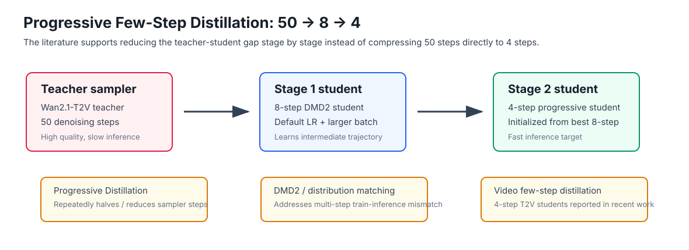
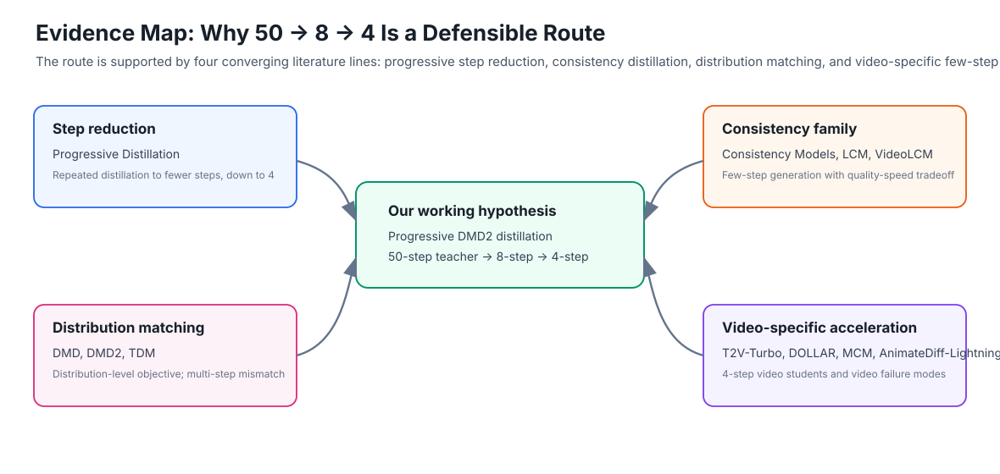

# Literature Support Report: Progressive Distillation for Wan2.1-T2V DMD2

Date: 2026-06-29
Project: Wan2.1-T2V-1.3B DMD2 distillation acceleration
Target route: `50-step teacher -> 8-step student -> 4-step student`

## Abstract

This report summarizes the literature basis for using progressive few-step distillation in our Wan2.1-T2V DMD2 experiments. The key claim is that the current `50 -> 8 -> 4` route is not an ad-hoc engineering choice: it is a practical synthesis of four established research directions: progressive step reduction, consistency distillation, distribution matching distillation, and video-specific few-step distillation. The strongest direct support comes from Progressive Distillation, which repeatedly reduces the sampler step count and demonstrates high-quality 4-step generation. DMD2 gives the closest training objective to our codebase and explicitly discusses multi-step sampling and train-inference mismatch. Recent video works such as T2V-Turbo, VideoLCM, DOLLAR, Motion Consistency Model, and AnimateDiff-Lightning further show that few-step video generation is an active and credible direction, while also explaining why batch size, time-step coverage, and training stability matter for video.

## Figures



**Figure 1.** Our experimental route follows the same high-level logic as progressive distillation: avoid an overly hard direct `50 -> 4` compression, first learn an intermediate 8-step student, then distill further to 4 steps.



**Figure 2.** The literature supports our route from four directions: sampler step reduction, consistency distillation, distribution matching, and video-specific few-step acceleration.

## Main Claim

Our working claim can be stated as:

> A `50 -> 8 -> 4` route is a defensible progressive distillation strategy for text-to-video diffusion acceleration. It reduces the teacher-student gap in stages, gives the 4-step student a stronger initialization, and aligns with recent evidence that video diffusion students can reach usable quality at 4 sampling steps when training is sufficiently stable.

This claim is narrower than saying that every 8-step or 4-step student must outperform its teacher. The literature supports the route, but also warns that few-step video distillation is sensitive to training distribution mismatch, step allocation, motion/appearance conflict, and insufficient batch or update stability.

## Evidence Table

| Priority | Paper | Venue / status | Key evidence | Relevance to our work |
|---:|---|---|---|---|
| 1 | [Progressive Distillation for Fast Sampling of Diffusion Models](https://arxiv.org/abs/2202.00512) | ICLR 2022 / arXiv | Distills a deterministic diffusion sampler into fewer sampling steps and repeatedly applies the procedure; reports successful reduction to 4-step generation on image benchmarks. | Direct conceptual basis for staged compression. Our `50 -> 8 -> 4` is a non-binary version of this progressive step-reduction principle. |
| 2 | [Improved Distribution Matching Distillation for Fast Image Synthesis](https://arxiv.org/abs/2405.14867) | DMD2, arXiv 2024 | Improves DMD with two-time-scale update, GAN loss, and a training procedure for multi-step sampling; identifies train-inference input mismatch in multi-step students. | Closest to our method. Supports the need to simulate student inference distributions during training and explains why multi-step DMD2 can fail if the training recipe is unstable. |
| 3 | [One-step Diffusion with Distribution Matching Distillation](https://arxiv.org/abs/2311.18828) | DMD, arXiv 2023 | Matches student and teacher at distribution level instead of requiring one-to-one trajectory matching; demonstrates large speedups. | Provides the original distribution matching objective behind DMD2. Useful for explaining why our student does not need to imitate every teacher trajectory exactly. |
| 4 | [Consistency Models](https://arxiv.org/abs/2303.01469) | ICML 2023 / arXiv | Supports one-step generation by design and allows multi-step sampling as a quality-compute tradeoff; can be trained by distilling pre-trained diffusion models. | Establishes the broader few-step distillation paradigm and justifies evaluating 4-step and 8-step students as distinct quality-speed points. |
| 5 | [Latent Consistency Models](https://arxiv.org/abs/2310.04378) | ICLR 2024 / arXiv | Distills latent diffusion models for high-resolution 2-4 step inference. | Supports latent-space few-step distillation, which is closer to modern text-to-image/video model practice than pixel-space-only diffusion. |
| 6 | [VideoLCM: Video Latent Consistency Model](https://arxiv.org/abs/2312.09109) | arXiv 2023 | Extends latent consistency distillation to video and reports high-fidelity, smooth synthesis with only 4 sampling steps. | Direct video support: 4-step video generation is plausible, but temporal consistency must be evaluated. |
| 7 | [T2V-Turbo](https://arxiv.org/abs/2405.18750) | arXiv 2024 | Combines video consistency distillation with mixed reward feedback; reports 4-step video generation preferred over 50-step teacher samples and more than 10x acceleration. | Strong support for 50-step teacher to 4-step text-to-video student as a serious research direction. Also suggests reward feedback may help if DMD2 alone leaves artifacts. |
| 8 | [DOLLAR](https://arxiv.org/abs/2412.15689) | arXiv 2024 | Combines variational score distillation, consistency distillation, and latent reward optimization for few-step 10-second video generation; reports strong 4-step student results against a 50-step DDIM teacher. | Supports few-step video distillation with explicit quality optimization. Relevant if we later add reward or VBench-driven fine-tuning. |
| 9 | [Motion Consistency Model](https://arxiv.org/abs/2406.06890) | NeurIPS 2024 / arXiv | Argues that directly applying image distillation to video can hurt frame quality; proposes disentangled motion and appearance distillation plus mixed trajectory distillation to reduce train-inference discrepancy. | Explains our observed failure modes: blurry frames, physical-rule issues, and temporal instability are expected risks in video distillation, not necessarily proof that progressive distillation is invalid. |
| 10 | [AnimateDiff-Lightning](https://arxiv.org/abs/2403.12706) | arXiv 2024 | Uses progressive adversarial diffusion distillation for fast video generation and adapts the method to video motion modules. | Additional video evidence for progressive/adversarial few-step distillation. |
| 11 | [SDXL-Lightning](https://arxiv.org/abs/2402.13929) | arXiv 2024 | Combines progressive and adversarial distillation for 1/2/4/8-step SDXL generation. | Useful methodological support: the 4-step and 8-step checkpoints can be treated as separate deployment points rather than a single final checkpoint. |
| 12 | [Adversarial Diffusion Distillation](https://arxiv.org/abs/2311.17042) | arXiv 2023 | Combines score distillation and adversarial loss to make 1-4 step high-quality image synthesis possible. | Supports the idea that low-step students often need extra realism/quality losses, which is consistent with DMD2's GAN component. |
| 13 | [Learning Few-Step Diffusion Models by Trajectory Distribution Matching](https://arxiv.org/abs/2503.06674) | arXiv 2025 | Proposes a step-aware objective combining trajectory and distribution matching; extends the idea to text-to-video and reports 4-NFE T2V acceleration. | Recent evidence that multi-step few-step students need sampling-step-aware training, aligning with our concerns about 8-step and 4-step transition coverage. |
| 14 | [TRACT: Denoising Diffusion Models with Transitive Closure Time-Distillation](https://arxiv.org/abs/2303.04248) | arXiv 2023 | Extends binary time distillation to reduce network calls for a fixed architecture. | Supports the general idea that time-interval compression can be learned through staged distillation rather than purely solver-level acceleration. |

## How the Literature Supports `50 -> 8 -> 4`

### 1. Progressive reduction is a known solution to the teacher-student gap

The original Progressive Distillation paper gives the cleanest justification. Its core idea is not merely "use fewer steps," but "reduce the number of sampling steps progressively." This matters for our setting because a direct `50 -> 4` compression asks the student to learn a very large denoising transition. A staged route makes the intermediate student learn a smaller gap first:

```text
50-step teacher distribution
        |
        | distill
        v
8-step student distribution
        |
        | distill again
        v
4-step student distribution
```

In our report, this can be described as a progressive step-reduction strategy: the 8-step student is not the final target, but an intermediate teacher-like model that makes 4-step distillation easier.

### 2. DMD2 is aligned with our actual training objective

DMD2 is the most relevant paper for our implementation because our framework uses a DMD2-style distribution matching objective. Its important contribution for us is the multi-step discussion: the paper identifies train-inference mismatch for multi-step students and modifies training to simulate inference-time generator samples. This is directly related to our empirical observation:

- Low-LR / small-effective-batch 8-step training produced blurry and unstable results.
- Restoring LR to `1e-5` and increasing batch made the 8-step student usable.
- The first 4-step-from-8 run had an early best checkpoint, but later checkpoints degraded physically.
- The larger-batch 4-step-from-8 run became usable and showed `0000500 -> 0002500` quality improvement.

The literature-based explanation is that multi-step DMD2 is more sensitive to input-distribution mismatch and unstable updates than a simple "more steps should be better" intuition suggests.

### 3. Video works show that 4-step video students are credible

The recent video literature is important because image distillation success does not automatically transfer to video. VideoLCM, T2V-Turbo, DOLLAR, MCM, and AnimateDiff-Lightning all treat video-specific few-step generation as a serious problem. The common evidence is:

- 4-step video generation is possible.
- Temporal consistency and motion quality must be checked, not only frame sharpness.
- Additional objectives such as reward feedback, adversarial loss, mixed trajectory distillation, or motion/appearance disentanglement may be needed.

This supports our current report design: visual comparison should include prompts that test motion, liquid flow, object interaction, camera movement, and mechanical consistency, not just static aesthetic quality.

## Connection to Our Experiment Logs

The literature supports the following interpretation of our recent results.

| Experiment | Observation | Literature-consistent interpretation |
|---|---|---|
| Initial low-LR 8-step DMD2 | 8-step student was blurry and worse than good 4-step checkpoints. | More sampling steps do not help if each transition is weakly learned; DMD2 multi-step mismatch and insufficient effective updates can dominate. |
| 8-step default LR + batch 12 | Quality became usable; `0002500` was visually best. | Stable few-step distillation requires adequate learning rate, batch scale, and coverage of time anchors. |
| First 4-step from best 8-step | `0000500` was best; later checkpoints had physical-rule collapse. | Few-step distillation can overfit or drift when the student distribution no longer matches the teacher-like target distribution. Early stopping is meaningful. |
| 4-step from 8-step 8node / batch-improved | Quality became usable and `0000500-0002500` improved with training. | Increasing effective batch/training stability can fix the failure mode; the route itself remains valid. |

## Practical Recommendations for the Next Report

1. Present `50 -> 8 -> 4` as a **progressive few-step distillation** route, not merely as "try a different step count."
2. Use Progressive Distillation as the primary theoretical support, and DMD2 as the method-specific support.
3. Use T2V-Turbo, DOLLAR, VideoLCM, MCM, and AnimateDiff-Lightning to argue that video few-step generation is active and credible.
4. Explicitly state that 8-step is not guaranteed to outperform 4-step unless the transitions are well learned. This explains why our early 8-step experiments failed.
5. In the final experimental report, show both:
   - speed: teacher 50-step vs student 8-step vs student 4-step;
   - quality: synchronized prompt-level videos, especially for physical and temporal consistency prompts.
6. Keep early stopping and checkpoint selection as a central part of the method. Few-step distillation quality can peak before the final iteration.

## Suggested Academic Wording

The following paragraph can be reused in the final report:

> We adopt a progressive few-step distillation strategy for accelerating Wan2.1-T2V generation. Instead of directly compressing the 50-step teacher sampler into a 4-step student, we introduce an intermediate 8-step student and then further distill it into a 4-step model. This design is motivated by progressive distillation, which repeatedly reduces the sampling budget while preserving generation quality, and by recent distribution-matching and consistency-distillation literature. DMD2 further motivates our implementation choice by formulating few-step distillation as distribution matching and by highlighting the train-inference mismatch in multi-step students. Recent video distillation works, including VideoLCM, T2V-Turbo, DOLLAR, Motion Consistency Model, and AnimateDiff-Lightning, show that few-step text-to-video generation is feasible but sensitive to motion consistency, frame quality, and training stability. Our empirical results are consistent with this view: low-effective-batch stages were unstable, while increasing the learning rate and effective batch improved both the 8-step intermediate model and the final 4-step progressive student.

## Limitations

The literature does not contain an identical recipe for `Wan2.1-T2V-1.3B + DMD2 + OpenVid + 50 -> 8 -> 4`. The support is therefore compositional:

- Progressive Distillation supports staged step reduction.
- DMD/DMD2 supports distribution matching and multi-step student training.
- Consistency/LCM works support few-step latent generation.
- VideoLCM/T2V-Turbo/DOLLAR/MCM/AnimateDiff-Lightning support few-step video generation and identify video-specific risks.

The next stage should add quantitative validation such as VBench, FVD, CLIP-text alignment, temporal consistency metrics, or human preference ranking. Visual inspection remains useful, but a stronger academic report should combine synchronized videos with at least one standardized metric.

## References

1. Tim Salimans and Jonathan Ho. [Progressive Distillation for Fast Sampling of Diffusion Models](https://arxiv.org/abs/2202.00512). ICLR 2022 / arXiv.
2. Tianwei Yin et al. [Improved Distribution Matching Distillation for Fast Image Synthesis](https://arxiv.org/abs/2405.14867). arXiv 2024.
3. Tianwei Yin et al. [One-step Diffusion with Distribution Matching Distillation](https://arxiv.org/abs/2311.18828). arXiv 2023.
4. Yang Song et al. [Consistency Models](https://arxiv.org/abs/2303.01469). ICML 2023 / arXiv.
5. Simian Luo et al. [Latent Consistency Models: Synthesizing High-Resolution Images with Few-Step Inference](https://arxiv.org/abs/2310.04378). arXiv 2023.
6. Xiang Wang et al. [VideoLCM: Video Latent Consistency Model](https://arxiv.org/abs/2312.09109). arXiv 2023.
7. Jiachen Li et al. [T2V-Turbo: Breaking the Quality Bottleneck of Video Consistency Model with Mixed Reward Feedback](https://arxiv.org/abs/2405.18750). arXiv 2024.
8. Zihan Ding et al. [DOLLAR: Few-Step Video Generation via Distillation and Latent Reward Optimization](https://arxiv.org/abs/2412.15689). arXiv 2024.
9. Yuanhao Zhai et al. [Motion Consistency Model: Accelerating Video Diffusion with Disentangled Motion-Appearance Distillation](https://arxiv.org/abs/2406.06890). NeurIPS 2024 / arXiv.
10. Shanchuan Lin and Xiao Yang. [AnimateDiff-Lightning: Cross-Model Diffusion Distillation](https://arxiv.org/abs/2403.12706). arXiv 2024.
11. Shanchuan Lin, Anran Wang, and Xiao Yang. [SDXL-Lightning: Progressive Adversarial Diffusion Distillation](https://arxiv.org/abs/2402.13929). arXiv 2024.
12. Axel Sauer et al. [Adversarial Diffusion Distillation](https://arxiv.org/abs/2311.17042). arXiv 2023.
13. Yihong Luo et al. [Learning Few-Step Diffusion Models by Trajectory Distribution Matching](https://arxiv.org/abs/2503.06674). arXiv 2025.
14. David Berthelot et al. [TRACT: Denoising Diffusion Models with Transitive Closure Time-Distillation](https://arxiv.org/abs/2303.04248). arXiv 2023.
