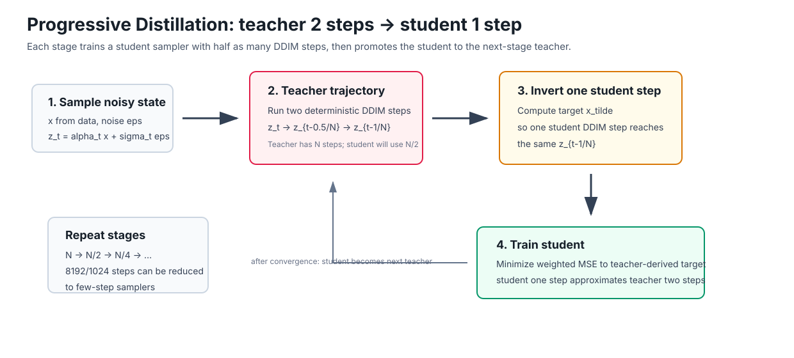

# 《Progressive Distillation for Fast Sampling of Diffusion Models》论文精读与实验启发

日期：2026-06-29
论文：Tim Salimans, Jonathan Ho, **Progressive Distillation for Fast Sampling of Diffusion Models**, ICLR 2022
链接：[arXiv](https://arxiv.org/abs/2202.00512) / [OpenReview](https://openreview.net/forum?id=TIdIXIpzhoI)

## 1. 为什么这篇论文对我们重要

我们当前的主线是 Wan2.1-T2V-1.3B 的 DMD2 蒸馏加速，核心路线是：

```text
50-step teacher -> 8-step student -> 4-step student
```

这篇论文是“渐进式蒸馏”思想最直接、最经典的出处之一。它解决的问题和我们高度一致：扩散模型质量好，但采样太慢；如果直接把很多步压到极少步，学生模型很难学稳，所以需要逐阶段减少采样步数。

论文的核心贡献可以概括为两点：

1. 提出一种 **progressive distillation** 方法：把一个 `N-step` deterministic diffusion sampler 蒸馏成 `N/2-step` student，然后重复这个过程。
2. 指出少步采样时，传统 `epsilon-prediction` 参数化不稳定，提出更适合 few-step distillation 的参数化和 loss weighting。

这对我们最重要的启发是：`50 -> 8 -> 4` 不是简单换 step 数，而应该被表述为 **progressive few-step distillation**。中间的 8-step student 是降低 teacher-student gap 的桥梁，而不是最终目标。

## 2. 论文背景：为什么扩散模型需要蒸馏

论文指出，扩散模型在图像生成质量上已经很强，但最大瓶颈是采样速度。高质量采样通常需要数百甚至数千次模型前向。对于实际应用，这种采样成本很高。

传统加速方式主要有两类：

- 改进 sampler，例如 DDIM、ODE solver、FastDPM 等；
- 减少噪声步数，但这通常会显著损失质量。

Progressive Distillation 的思路更接近“学习一个更快的 sampler”：让 student 模型直接学会 teacher 的多步采样效果。它不是改变网络大小，而是改变这个网络在采样轨迹上每一步承担的 denoising 距离。

论文把 DDIM sampler 解释成 probability flow ODE 的数值积分器。因此，蒸馏可以理解为：

> 把原来需要多次网络评估才能完成的 ODE 积分，摊销进一个新模型，使它用更少步完成近似相同的积分。

## 3. 方法核心：teacher 两步，student 一步



论文每一阶段都执行同一个基本操作：用 teacher 的两步 DDIM 轨迹，构造一个 student 单步应该预测的目标。

### 3.1 单阶段蒸馏流程

假设当前 teacher sampler 需要 `N` 步，目标是训练一个 `N/2` 步的 student。

每次训练迭代：

1. 从训练集采样干净图像 `x`。
2. 随机采样一个离散时间点 `t = i / N`。
3. 加噪得到 `z_t = alpha_t x + sigma_t eps`。
4. teacher 从 `z_t` 开始走两小步 DDIM：
   - `z_t -> z_{t - 0.5/N}`
   - `z_{t - 0.5/N} -> z_{t - 1/N}`
5. 反推一个 teacher-derived target `x_tilde`：如果 student 在 `z_t` 预测这个 `x_tilde`，那么 student 只走一步 DDIM 就能到达 teacher 两步后的 `z_{t - 1/N}`。
6. 用 weighted MSE 训练 student 去预测这个 `x_tilde`。
7. 当前 student 收敛后，把它变成下一阶段 teacher，并继续把步数减半。

这个过程可以写成：

```text
Teacher: z_t --DDIM--> z_{t-0.5/N} --DDIM--> z_{t-1/N}
Student: z_t -------- one larger DDIM step --------> z_{t-1/N}
```

这就是论文最关键的技巧：student 不是直接回归真实数据 `x`，而是回归一个由 teacher trajectory 推导出来的目标 `x_tilde`。

### 3.2 为什么不直接用真实图像 `x` 作为目标

论文强调，给定一个 noisy latent `z_t`，真实图像 `x` 并不是唯一确定的，因为很多不同图像加噪后都可能对应到相似的 `z_t`。如果直接预测 `x`，模型会倾向于预测多个可能图像的平均，少步采样时容易变糊。

而 teacher-derived target `x_tilde` 是由 teacher 和当前 `z_t` 确定的，它对应的是“沿 teacher 轨迹应该走到哪里”。这个 target 更尖锐，更适合训练一个快速 sampler。

对我们来说，这一点很重要：少步蒸馏不能只看 final image regression，更要关心 student 在采样轨迹上的每一段 transition 是否学对。

## 4. 逐步减半为什么比直接大幅压缩更稳

论文的主流程是每阶段减半：

```text
8192 -> 4096 -> 2048 -> ... -> 16 -> 8 -> 4
```

它也做了一个重要 ablation：如果每次把步数除以 4，而不是除以 2，效果不如逐次减半。论文的结论是，在计算预算有限时，与其跳过蒸馏阶段，不如每个减半阶段少训一些 update。

这对我们非常关键：

- 我们的路线 `50 -> 8 -> 4` 本质上是渐进式，但 `50 -> 8` 这一步压缩倍率较大。
- 如果 8-step 初始化不稳，文献支持的改进方向不是直接否定 progressive distillation，而是考虑更平滑的中间阶段，例如 `50 -> 16 -> 8 -> 4`。
- 我们后面观察到提升 LR 和 batch 后 8-step 质量显著改善，这说明问题更可能是训练稳定性不足，而不是路线本身错误。

## 5. 参数化与 loss：few-step 下 epsilon-prediction 的风险

论文的另一个核心贡献是讨论 diffusion model 的参数化。

传统 DDPM 常用 `epsilon-prediction`，即网络预测噪声 `eps`。这在多步采样时可行，但论文指出它在极少步 distillation 中会出现问题：

- 当时间接近最高噪声端，signal-to-noise ratio 接近 0；
- `epsilon-prediction` 隐含的 `x` 预测会涉及除以很小的 `alpha_t`；
- 小的噪声预测误差会被放大成很大的图像预测误差；
- 在 one-step 或 few-step 场景，后续步骤太少，无法修正早期误差。

因此论文尝试了更稳定的参数化：

- 直接预测 `x`；
- 同时预测 `x` 和 `eps`，再融合；
- 预测 `v = alpha_t eps - sigma_t x`。

其中 `v-prediction` 后来在很多 diffusion 系统中变得很重要，因为它在高噪声和低噪声区域之间更平衡。

对我们来说，这个经验可以转化成一个排查项：

- Wan / FastGen 当前 student 的训练目标和参数化是否在高噪声端稳定？
- `t_list` 的高噪声锚点是否过密或过稀？
- 少步 student 是否在最高噪声段出现不可修正的早期误差？

这也解释了为什么“8 step 理论上更多步，但质量不一定更好”：如果每个 transition 的预测不稳，8 次错误累积可能比 4 次强 transition 更糟。

## 6. 实验结果：论文证明了什么

论文在 CIFAR-10、ImageNet、LSUN 等图像生成 benchmark 上验证了 progressive distillation。

关键结果包括：

- 从高步数 sampler 出发，可以逐步蒸馏到 4-step，并且感知质量损失很小。
- CIFAR-10 上报告了 4-step FID 约 3.0 的结果。
- ImageNet 和 LSUN 上也能从 1024 或更多步数压缩到少步。
- 完整 progressive distillation 的训练成本没有超过训练原始 teacher 的成本。
- 当采样步数大于等于 4 时，每阶段训练 update 可以显著减少仍保持较好性能；但在 1-step/2-step 时，训练不足带来的质量损失更明显。
- 跳过中间阶段、一次压缩过多，效果更差。

论文真正证明的不是“4 step 一定最好”，而是：

> 如果每个阶段的 teacher-student gap 控制得足够小，并且训练目标、参数化和优化足够稳定，那么 diffusion sampler 可以被逐步压缩到很少步。

## 7. 和我们 DMD2 工作的关系

这篇论文和我们当前 DMD2 工作不是同一个 objective。

| 维度 | Progressive Distillation | 我们当前 DMD2 路线 |
|---|---|---|
| 核心目标 | 让 student 一步匹配 teacher 两步 DDIM | 让 student 生成分布匹配 teacher / data 分布 |
| 蒸馏信号 | teacher trajectory target `x_tilde` | DMD2 distribution matching、fake score、GAN loss |
| 阶段设计 | 通常每阶段步数减半 | `50 -> 8 -> 4`，工程上做了非严格减半 |
| 关键风险 | 参数化不稳、跳阶段过大、低步数训练不足 | multi-step train-inference mismatch、batch 小、更新不稳、时间锚点覆盖不足 |
| 共同点 | 都是 few-step sampler distillation | 都需要逐阶段降低 gap，并验证 checkpoint 质量 |

因此，我们不能直接把论文算法照搬到 DMD2；但可以学习它的训练原则：

1. 不要直接把 teacher 压到极少步。
2. 每一阶段要有足够稳定的优化。
3. 中间 student 的质量决定下一阶段上限。
4. 极少步模型对参数化、时间分布和 loss 权重非常敏感。
5. 少步质量可能需要早停，而不是盲目训练到最大 iter。

## 8. 对我们已有实验的解释

### 8.1 为什么早期 8-step 失败不等于路线失败

我们早期低学习率、小有效 batch 的 8-step student 很模糊，甚至不如 4-step baseline。按这篇论文的视角，这并不奇怪：

- 8-step 需要学习 8 个 transition；
- 如果每个 transition 都没学好，错误会逐步累积；
- 少步模型没有足够多的后续步骤修正早期错误；
- 如果训练 update 和 batch 不够稳定，student 学到的不是可靠的快速积分器。

后来我们把 LR 恢复到默认 `1e-5`，并把 batch 提升到更合理的规模，8-step 质量明显提升。这和论文强调的“每阶段需要训练到足够稳定”是一致的。

### 8.2 为什么第一轮 4-step from 8 出现后期退化

第一轮 `4-step from 8` 中，`0000500` 最好，`0001000-0002500` 反而出现物理规则崩坏。

这可以理解为 few-step distillation 的过训练或分布漂移：当 student 的采样分布逐渐偏离 teacher 轨迹，继续优化不一定会让推理质量更好。论文虽然没有讨论视频物理规则，但它明确说明 few-step distillation 对训练 schedule 和 step reduction 方式敏感。

这支持我们采用 checkpoint sweep，而不是默认选择最后一个 checkpoint。

### 8.3 为什么提升 batch 后 4-step from 8 变好

最新 `8node / batch-improved` 的 `4-step from 8` 结果显示：

- 质量可用；
- `0000500 -> 0002500` 呈提升趋势；
- 之前明显的物理规则缺失得到改善。

按论文经验，这说明更稳定的训练使每个阶段的 student 更接近“学习到的快速积分器”，而不是在少步采样轨迹上累积误差。

## 9. 我们应该从论文中学习什么

### 经验 1：把 `50 -> 8 -> 4` 明确写成 progressive distillation

报告中不应只写“训练 8 step 和 4 step student”，而应写：

> 我们采用 progressive few-step distillation：先将 50-step teacher 压缩到 8-step intermediate student，再从最优 8-step checkpoint 初始化 4-step student。

这样能直接对齐论文贡献。

### 经验 2：中间阶段不是可有可无

论文的 ablation 说明，跳过中间蒸馏阶段通常不如逐阶段压缩。对应到我们，如果 `50 -> 8` 仍不稳，下一步更合理的尝试是：

```text
50 -> 16 -> 8 -> 4
```

而不是直接否定 4-step 或盲目增加 8-step iter。

### 经验 3：每一阶段都要看“有效 student 更新量”

论文中每个阶段使用了大量 parameter updates，并且少步数越低越敏感。我们的 DMD2 训练中还有 `student_update_freq`，所以 nominal iter 不等于 student 实际更新次数。

后续报告里建议同时记录：

- `max_iter`
- `student_update_freq`
- 有效 student update 次数
- global batch
- 学习率
- `t_list`
- 每个 checkpoint 的视觉结论

这样才能解释为什么 batch 提升后质量改善。

### 经验 4：时间锚点和最高噪声端要严肃处理

论文在离散时间上训练 progressive distillation，并强调最高噪声端要匹配测试时的纯噪声输入。对应我们：

- `t_list` 必须和 inference 使用的时间点一致；
- 最高噪声点、最低噪声点、以及中间 jump 的设计都可能影响质量；
- 8-step 不应只看“步数更多”，还要看每段 transition 的难度是否合理。

### 经验 5：少步蒸馏不一定越训越好

论文目标是每阶段“收敛后再进入下一阶段”，但实际工程中，特别是视频 DMD2，视觉质量可能在中途达到峰值。我们应该保留当前策略：

- 每 500 iter 保存 checkpoint；
- 每个 checkpoint 跑同一组 10 prompts；
- 用同步 HTML 比较；
- 按质量选择阶段 teacher，而不是默认选择最终 checkpoint。

### 经验 6：我们的报告需要强调“质量-速度-稳定性”三角

Progressive Distillation 论文关注图像 FID 和采样步数；我们的视频任务还必须加上：

- 时序一致性；
- 物理规则；
- 动作速度；
- 多物体一致性；
- camera motion 稳定性。

因此，我们的 10 prompt eval set 是合理的，因为它覆盖了液体、动物、机械、人物、相机运动等 failure modes。

## 10. 对下一步实验的建议

基于这篇论文，我建议后续实验按以下优先级推进：

1. **继续使用最佳 8-step 作为 4-step 初始化。** 这是 progressive distillation 的核心逻辑。
2. **保留 batch-improved 设置。** 最新实验说明有效 batch / 稳定训练对 4-step from 8 很关键。
3. **记录有效 student update。** 不只报告 iter，要报告 student 实际更新次数。
4. **如果再次遇到不稳定，尝试 `50 -> 16 -> 8 -> 4`。** 论文明确支持更平滑的阶段压缩。
5. **检查参数化和 loss 权重。** 如果 Wan/DMD2 当前参数化在高噪声端不稳，few-step 会被放大。
6. **增加自动指标。** 论文使用 FID 等指标；我们至少应补充 VBench、CLIP alignment、temporal consistency 或人工偏好表。
7. **把早停写入 recipe。** 对视频少步蒸馏，最佳 checkpoint 可能早于最大 iter。

## 11. 可以直接写进最终汇报的表述

> Progressive Distillation provides the most direct methodological support for our `50 -> 8 -> 4` acceleration route. The paper shows that a deterministic diffusion sampler can be distilled stage by stage, with each student learning to replace multiple teacher sampling steps using fewer student steps. This motivates our design choice of introducing an 8-step intermediate student before training the final 4-step model. Although our implementation uses DMD2 rather than the exact DDIM trajectory loss in the paper, the same principle applies: reducing the teacher-student gap progressively makes few-step generation more trainable. Our empirical results further match the paper's practical message. Low-effective-batch stages were unstable, while increasing learning rate and effective batch improved both the 8-step intermediate model and the final 4-step student.

中文版本：

> Progressive Distillation 是我们 `50 -> 8 -> 4` 加速路线最直接的方法论支撑。该论文证明，确定性扩散采样器可以通过逐阶段蒸馏不断减少采样步数，让 student 用更少步近似 teacher 的多步采样效果。因此，我们先训练 8-step intermediate student，再从最优 8-step checkpoint 初始化 4-step student，而不是直接把 50-step teacher 压缩到 4 step。虽然我们的实现采用 DMD2 的 distribution matching objective，而不是论文中的 DDIM trajectory target，但两者共享同一个核心原则：逐步降低 teacher-student gap，可以显著提升 few-step student 的可训练性。我们的实验也与这一经验一致：低有效 batch 阶段不稳定，而提升学习率和 batch 后，8-step intermediate model 与最终 4-step student 的质量都明显改善。

## 12. 局限性

这篇论文不能被过度解读。它的实验主要是图像生成，不是 text-to-video；它使用 DDIM trajectory distillation，不是 DMD2；它主要关注 FID 和采样步数，没有评估视频物理规则和时序一致性。

因此，它对我们的支持是“方法论支持”，不是“同设置复现证明”。更严谨的说法应是：

> 我们的路线借鉴了 Progressive Distillation 的逐阶段压缩思想，并将其与 DMD2 的分布匹配训练结合，用于 Wan2.1-T2V 的视频生成加速。

## 参考资料

1. Tim Salimans and Jonathan Ho. [Progressive Distillation for Fast Sampling of Diffusion Models](https://arxiv.org/abs/2202.00512). ICLR 2022.
2. OpenReview page: [Progressive Distillation for Fast Sampling of Diffusion Models](https://openreview.net/forum?id=TIdIXIpzhoI).
3. Tianwei Yin et al. [Improved Distribution Matching Distillation for Fast Image Synthesis](https://arxiv.org/abs/2405.14867). arXiv 2024.
4. Yang Song et al. [Consistency Models](https://arxiv.org/abs/2303.01469). ICML 2023.
