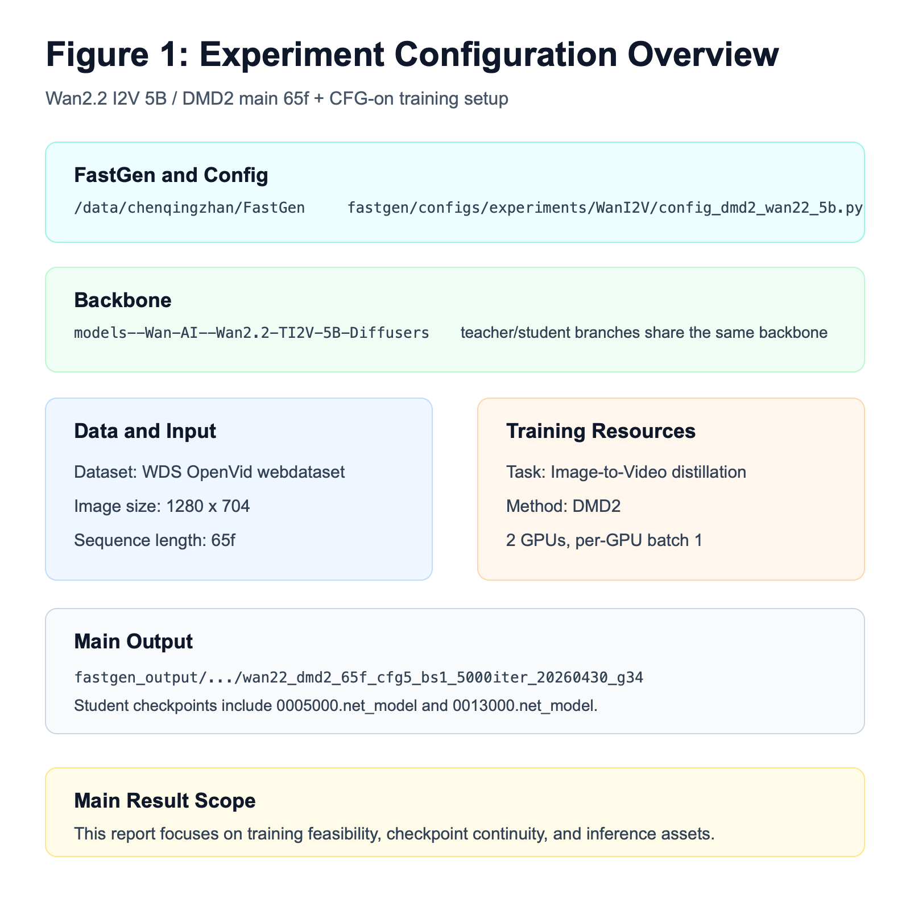
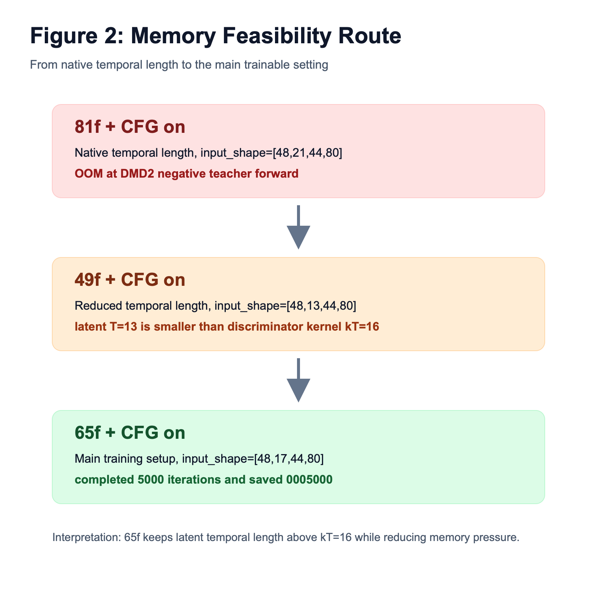
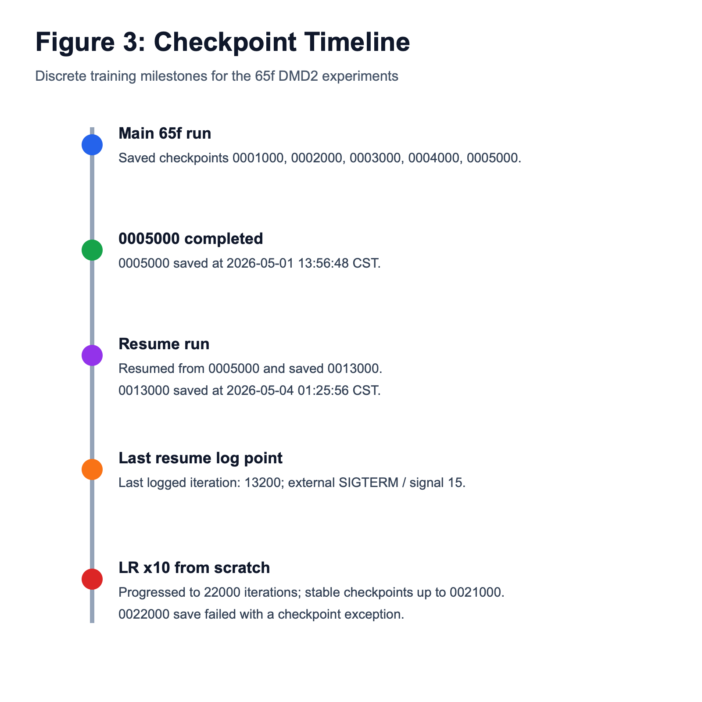

# ARIN 6900 Project Report

# Midterm Report: Wan2.2 I2V 5B DMD2 Distillation with FastGen

Chen Hing Chin (21205108)

## Abstract

This report presents my midterm work on DMD2 distillation for Wan2.2 Image-to-Video (I2V) generation under the FastGen framework. The goal is to evaluate whether the native Wan2.2 I2V 5B DMD2 training setup can be adapted to a limited 2x32GB GPU environment while still completing training, saving checkpoints, and running student-only I2V inference. Before this work, I used Wan2.1 / FFGO-compatible experiments to become familiar with FastGen training, checkpoint management, and inference asset archiving. The main work in this report focuses on Wan2.2 I2V 5B, memory feasibility, DMD2 training stability, and checkpoint usability. The original 81f + CFG on setup reached an out-of-memory condition during the DMD2 negative teacher forward path. A shorter 49f attempt reduced temporal length but became incompatible with the discriminator temporal kernel. The main training configuration was therefore adjusted to 65f + CFG on, which completed 5000 iterations, saved checkpoints from `0001000` to `0005000`, resumed from `0005000`, and saved `0013000`. Additional LR x10 from-scratch training progressed to 22000 iterations, with stable checkpoints up to `0021000` and a failed save attempt at `0022000`. This report focuses on training feasibility, checkpoint saving, and inference flow archiving; subjective and quantitative video quality evaluation is left for follow-up work.

## 1 Introduction

Large-scale video generation models are expensive to train and evaluate because both spatial resolution and temporal length contribute directly to GPU memory usage. This project studies whether FastGen can support a practical low-resource DMD2 distillation workflow for Wan2.2 I2V 5B. Here, I2V means Image-to-Video, where the model generates a video from an input image and text prompt. DMD2 is the distillation training method used in the experiment. CFG means Classifier-Free Guidance, and this report describes it as CFG on or CFG off in the main text. The notation f means frames, so 81f denotes an 81-frame training sequence.

The practical motivation is to turn a native FastGen Wan2.2 I2V DMD2 configuration into an executable experiment on available 32GB GPUs. The work began with process preparation: I first used Wan2.1 / FFGO-compatible runs to understand the FastGen training entry point, checkpoint layout, and student-only inference workflow. The midterm work then moved to Wan2.2 I2V 5B / DMD2, where the central questions were memory feasibility, temporal-length compatibility, checkpoint continuity, and inference asset archiving.

This report is organized by experimental function. Section 2 summarizes the related technical context. Section 3 describes the goals, scope, and system design. Section 4 discusses memory feasibility exploration. Section 5 records the training and checkpoint process. Section 6 summarizes the inference assets. Section 7 concludes the report, and Section 8 lists local project references used by this report.

## 2 Related Works

The experiment is built around the FastGen training framework and the Wan2.2 TI2V 5B Diffusers backbone. FastGen provides the experiment configuration, data loading path, distributed training setup, and checkpoint output structure. The Wan2.2 TI2V 5B checkpoint supplies the base backbone used by the teacher and student training branches in this configuration.

Diffusion model distillation is used to reduce the cost of generation or training-time supervision while preserving the behavior of a larger generative model. In this project, DMD2 is the selected distillation method. The configuration uses `model.teacher: null`; therefore, the report does not describe a separate independent teacher path. Instead, the teacher and student branches are treated as part of the same Wan2.2 TI2V 5B backbone configuration.

CFG, or Classifier-Free Guidance, is relevant because it changes the amount of computation required during the training step. In the 81f baseline attempt, the memory bottleneck appeared during the DMD2 CFG negative teacher forward path. This made CFG not only a generation-quality control but also a key systems variable for memory feasibility.

The training data is organized in WebDataset (WDS) format. The dataset path used in the experiment is `WDS:/data/datasets/OpenVid-1M/webdataset`. The dataset directory contains 22 tar shards and occupies about 22G. Exact dataset-scale accounting is left for follow-up work.

## 3 Overview

### 3.1 System Goals and Scope

The goal of the midterm experiment is to demonstrate a complete low-resource workflow for Wan2.2 I2V 5B DMD2 training. A complete workflow means that the model can be trained for a meaningful number of iterations, checkpoints can be saved and resumed, and saved student checkpoints can be loaded for I2V inference asset generation.

The scope is intentionally limited to training feasibility, checkpoint continuity, and inference asset archiving. Formal video quality assessment, metric evaluation, and checkpoint-to-checkpoint quality comparison are left for follow-up work.

### 3.2 Work Items

#### 3.2.1 Core Work Items

The core work items are as follows:

- Review the native FastGen Wan2.2 I2V 5B DMD2 configuration.
- Test whether 81f + CFG on can run under the available 2x32GB GPU setting.
- Identify whether shorter temporal settings remain compatible with the discriminator temporal kernel.
- Select a main training configuration that can complete checkpoint saving.
- Run student-only I2V inference using saved checkpoints and archive local visual assets.

#### 3.2.2 Supplementary Work Items

The supplementary work includes previous Wan2.1 / FFGO-compatible process preparation, local organization of inference videos, and the generation of figures and tables for the midterm report. These items support the main Wan2.2 I2V 5B DMD2 work but are not presented as the central experimental result.

### 3.3 System Design

#### 3.3.1 Training Architecture

The FastGen directory is `/data/chenqingzhan/FastGen`. The original training configuration is `/data/chenqingzhan/FastGen/fastgen/configs/experiments/WanI2V/config_dmd2_wan22_5b.py`. The base model and teacher-student backbone are stored at `/data/chenqingzhan/.cache/huggingface/models--Wan-AI--Wan2.2-TI2V-5B-Diffusers`.

The main training configuration uses image size `1280 x 704`, sequence length 65f, two GPUs, per-GPU batch size 1, and global batch size 2. FSDP and CPU offload are used as resource-management mechanisms. In the report tables, CFG is described as on or off; in this experiment, CFG on corresponds to `guidance_scale=5.0` in the configuration.

#### 3.3.2 Data and Checkpoint Flow

The data path is `WDS:/data/datasets/OpenVid-1M/webdataset`. The main output path is `/data/chenqingzhan/fastgen_output/fastgen/wan22_5b_i2v_dmd2/wan22_dmd2_65f_cfg5_bs1_5000iter_20260430_g34`. Student checkpoints are stored under the output directory, including `checkpoints/0005000.net_model/` and `checkpoints/0013000.net_model/`.

Table 1 summarizes the main experiment configuration.

| Item | Setting |
|---|---|
| Framework | FastGen |
| Main model | Wan2.2 TI2V 5B Diffusers backbone |
| Task | Image-to-Video (I2V) distillation |
| Method | DMD2 |
| Dataset | `WDS:/data/datasets/OpenVid-1M/webdataset` |
| Image size | `1280 x 704` |
| Main sequence length | 65f |
| CFG | on in the main training configuration |
| GPU setting | 2 GPUs, 32GB class |
| Per-GPU batch | 1 |
| Global batch | 2 |

## 4 Memory Feasibility Exploration

### 4.1 81-frame CFG-on Baseline

The first feasibility check used 81f + CFG on. The tensor setting was `[48, 21, 44, 80]` with `sequence_length=81`. This setting represents the higher temporal-length configuration and was important as a baseline for understanding the original memory pressure.

The run reached an out-of-memory condition during the DMD2 negative teacher forward path. The memory context included an attempted allocation of 1.27 GiB, only 96 MiB free memory, process memory of 31.18 GiB, and PyTorch allocated memory of 30.21 GiB. This result showed that 81f + CFG on pushed the available 32GB GPU memory beyond the practical boundary for the current training setup.

### 4.2 49-frame Temporal-Kernel Check

The next direction reduced the temporal length to 49f + CFG on. The tensor setting was `[48, 13, 44, 80]` with `sequence_length=49`. It reduces memory demand but changes the latent temporal length to 13.

The discriminator temporal kernel uses `kT=16`, so a latent temporal length of 13 is too short for the kernel. For this reason, 49f was not used as the main training setting. This failure mode is different from the 81f memory bottleneck: 81f fails due to memory pressure, while 49f fails because the temporal dimension becomes too short for the discriminator.

### 4.3 65-frame Main Training Configuration

The final main configuration uses 65f + CFG on. The tensor setting was `[48, 17, 44, 80]` with `sequence_length=65`. This setting keeps the latent temporal length above the discriminator kernel requirement while reducing memory pressure compared with 81f.

The 65f configuration became the main training setup because it balanced the available GPU memory and the temporal kernel constraint. During the 5000-iteration run, the peak GPU memory was about 28.078 GiB and the maximum reserved memory was about 30.459 GiB. Later iterations were typically in the 24-25 seconds per iteration range.

## 5 Training Progress and Checkpoint Management

### 5.1 5000-iteration Run

The main 65f + CFG on training run is referred to as the main 65f run in the report tables; its full output directory is listed in References. It completed 5000 training iterations and saved checkpoints at `0001000`, `0002000`, `0003000`, `0004000`, and `0005000`.

The `0005000` checkpoint was saved at `2026-05-01 13:56:48 CST`, and the run ended at `2026-05-01 13:57:02 CST`. This run establishes that the adjusted 65f configuration can complete a multi-thousand-iteration training target and produce a complete checkpoint sequence at the chosen saving interval.

### 5.2 Resume Training from 0005000

The next run resumed from `0005000` and is referred to as the resume run in the report tables. The full output directory is listed in References. The run saved checkpoint `0013000` at `2026-05-04 01:25:56 CST`.

The last logged iteration before termination was 13200. The termination was recorded as external SIGTERM / signal 15. The source of that signal is not treated as a training conclusion in this report. The important training conclusion is that the run resumed from `0005000` and saved a later student checkpoint at `0013000`.

### 5.3 LR x10 From-Scratch Run

The LR x10 from-scratch run is referred to as the LR x10 run in the report tables; its full output directory is listed in References. It used `trainer.resume=False`, and the three optimizer learning rates were set to `1e-4`.

This run progressed to 22000 iterations. Stable checkpoint saving reached `0021000`, while the attempt to save `0022000` failed with a checkpoint exception. The report therefore treats `0021000` as the last stable checkpoint from this run and leaves the root cause of the `0022000` save failure for follow-up investigation.

Table 2 summarizes the checkpoint timeline.

| Stage | Run or setting | Checkpoint / iteration result |
|---|---|---|
| Main 65f training | main 65f run | Saved `0001000` to `0005000` |
| Main run completion | Same run | `0005000` saved at `2026-05-01 13:56:48 CST` |
| Resume training | resume run | Saved `0013000` at `2026-05-04 01:25:56 CST` |
| Resume final log point | Same resume run | Last logged iteration 13200; external SIGTERM / signal 15 |
| LR x10 from scratch | LR x10 run | Progressed to 22000; stable checkpoints up to `0021000`; `0022000` save failed |

## 6 Inference Asset Archiving

### 6.1 Student-only I2V Inference

After checkpoint saving, I archived student-only I2V inference outputs for `0005000` and `0013000`. The `0005000` assets are stored at `artifacts/inference_videos/2026-05-01/wan22_dmd2_65f_cfg5_0005000_10samples_20260501_per_sample/`. This set contains 10 mp4 outputs, 10 prompt text files, and 10 image path text files. Since first-frame PNG files are not available locally for this set, it is treated as an output-only asset group.

The `0013000` checkpoint has two local asset groups. The first group is `artifacts/inference_videos/2026-05-04/wan22_dmd2_65f_cfg5_0013000_10distinct_20260504/`, which contains 10 distinct prompts, first-frame PNG files, and mp4 outputs. The second group is `artifacts/inference_videos/2026-05-05/wan22_dmd2_65f_cfg5_0013000_0501_first5_20260504/`, which reuses the first five inputs from the 2026-05-01 set for later aligned comparison.

### 6.2 Visual Sample

Figure 1 shows the `0013000` student-only I2V visual asset contact sheet. The purpose of this figure is to document the archived prompt, first-frame, and output-frame relationship. It does not provide a subjective or quantitative quality evaluation.

The inference section therefore supports a process-level conclusion: saved student checkpoints can be loaded into the I2V inference workflow and can produce local output assets. Video quality scoring, temporal consistency evaluation, and comparison between checkpoints remain future work.

## 7 Conclusion

This midterm work completed a practical feasibility study for Wan2.2 I2V 5B DMD2 distillation under FastGen. The original 81f + CFG on configuration reached a memory bottleneck during the DMD2 negative teacher forward path. Reducing the temporal length to 49f avoided that exact memory setting but made the latent temporal dimension shorter than the discriminator temporal kernel. The final 65f + CFG on setting provided a workable compromise for the available 2x32GB GPU environment.

The 65f main training run completed 5000 iterations and saved checkpoints from `0001000` to `0005000`. The resume run continued from `0005000` and saved `0013000`, with the last logged iteration at 13200 before an external SIGTERM / signal 15. The LR x10 from-scratch run progressed to 22000 iterations, saved stable checkpoints up to `0021000`, and failed during the `0022000` save attempt.

The current report establishes training feasibility, checkpoint continuity, and student-only inference asset archiving. The next stage should focus on video quality evaluation, metric design, first-frame and prompt alignment across checkpoints, root-cause analysis for the `0022000` checkpoint failure, and further confirmation of dataset-scale details and related configuration differences.

## 8 References

[1] FastGen Wan2.2 I2V DMD2 configuration: `/data/chenqingzhan/FastGen/fastgen/configs/experiments/WanI2V/config_dmd2_wan22_5b.py`.

[2] Wan2.2 TI2V 5B Diffusers backbone path: `/data/chenqingzhan/.cache/huggingface/models--Wan-AI--Wan2.2-TI2V-5B-Diffusers`.

[3] OpenVid WebDataset path: `WDS:/data/datasets/OpenVid-1M/webdataset`.

[4] Main training output directory: `/data/chenqingzhan/fastgen_output/fastgen/wan22_5b_i2v_dmd2/wan22_dmd2_65f_cfg5_bs1_5000iter_20260430_g34`.

[5] Local inference asset directory for `0013000`: `artifacts/inference_videos/2026-05-04/wan22_dmd2_65f_cfg5_0013000_10distinct_20260504/`.

[6] Resume training output directory: `/data/chenqingzhan/fastgen_output/fastgen/wan22_5b_i2v_dmd2/wan22_dmd2_65f_cfg5_bs1_5000iter_20260430_g34_resume_from5000_20260501_g56`.

[7] LR x10 from-scratch output directory: `/data/chenqingzhan/fastgen_output/fastgen/wan22_5b_i2v_dmd2/wan22_dmd2_65f_cfg5_bs1_lr10x_fromscratch_20260504_g56`.

## 9 Appendix: Meeting Minutes

### Minutes of the 1st Project Meeting

| Item | Detail |
|---|---|
| Date | Monday, April 20, 2026 |
| Time | 2:00 pm |
| Place | Online Zoom meeting |
| Present | Luyan LIU; Hingchin CHEN; YSzelong LAM; Hao XU; Zhangxizi QIU; Hongrui XIAO; Yijia LI; Zhiming WANG; Rui ZHONG; Jieyi WANG; Tszwai FONG; Prof. Kai CHEN |
| Apology | None |
| Note-taker | Hingchin Chen |

**A Approval of Minutes**  
The meeting lasted approximately 60 minutes.

**B Discussion Items**

- **Hingchin Chen:** Reported that the public FFGO workflow is based on a Wan2.2-I2V-A14B + LoRA setup and is not directly equivalent to the FastGen training interface. Proposed to first validate the native FastGen Wan2.2 TI2V/I2V path before attempting to connect a real FFGO teacher.
- **Prof. / leader response:** Agreed that the immediate priority should be a runnable distillation pipeline rather than final visual quality. Suggested separating the problem into two tracks: native Wan2.2 DMD2 feasibility and later FFGO teacher integration.
- **Action items:** Check the available WanI2V configuration, confirm the OpenVid WebDataset path, and prepare a DMD2 smoke run based on the existing FastGen Wan2.2 5B configuration.

**C Meeting Adjournment**  
The meeting adjourned at 3:00 pm. The next discussion would focus on memory feasibility and whether the native CFG setting can run under the available GPU resources.

### Minutes of the 2nd Project Meeting

| Item | Detail |
|---|---|
| Date | Monday, April 27, 2026 |
| Time | 2:00 pm |
| Place | Online Zoom meeting |
| Present | Luyan LIU; Hingchin CHEN; YSzelong LAM; Hao XU; Zhangxizi QIU; Hongrui XIAO; Yijia LI; Zhiming WANG; Rui ZHONG; Jieyi WANG; Tszwai FONG; Prof. Kai CHEN |
| Apology | None |
| Note-taker | Hingchin Chen |

**A Approval of Minutes**  
The meeting lasted approximately 60 minutes.

**B Discussion Items**

- **Hingchin Chen:** Reported that FastGen native Wan2.2 TI2V 5B / DMD2 can enter the training loop but has strong memory pressure. The original CFG-on setting caused an OOM during the teacher guidance path, while a reduced-resource setting could pass the first real student update and save an initial checkpoint.
- **Prof. / leader response:** Recommended treating the result as a systems feasibility baseline. The feedback was to keep careful notes on GPU memory, checkpoint saving, and resume behavior, and to avoid presenting visual quality claims before there is a consistent evaluation protocol.
- **Action items:** Continue monitoring the 5000-iteration run, confirm checkpoint continuity, prepare fixed-prompt student inference after checkpoint saving, and keep a separate list of remaining gaps for FFGO A14B + LoRA teacher integration.

**C Meeting Adjournment**  
The meeting adjourned at 3:00 pm. The next discussion would focus on whether a CFG-on low-resource variant could be made trainable.

### Minutes of the 3rd Project Meeting

| Item | Detail |
|---|---|
| Date | Monday, May 4, 2026 |
| Time | 2:00 pm |
| Place | Online Zoom meeting |
| Present | Luyan LIU; Hingchin CHEN; YSzelong LAM; Hao XU; Zhangxizi QIU; Hongrui XIAO; Yijia LI; Zhiming WANG; Rui ZHONG; Jieyi WANG; Tszwai FONG; Prof. Kai CHEN |
| Apology | None |
| Note-taker | Hingchin Chen |

**A Approval of Minutes**  
The meeting lasted approximately 60 minutes.

**B Discussion Items**

- **Hingchin Chen:** Summarized the low-resource configuration search: 81f + CFG on reached OOM, 49f became too short for the discriminator temporal kernel, and 65f + CFG on became the main trainable setting. Also reported that the 5000-iteration checkpoint sequence was complete and that resume training produced a later 0013000 checkpoint.
- **Prof. / leader response:** Suggested framing the midterm report around training feasibility, checkpoint continuity, and inference-flow archiving. The response was to keep visual samples as supporting assets only and leave subjective or quantitative video-quality assessment for a later stage.
- **Action items:** Prepare the midterm report, organize checkpoint and inference assets, list unresolved items such as the 0022000 save failure and exact quality evaluation plan, and keep future comparison with teammate configurations as an optional follow-up.

**C Meeting Adjournment**  
The meeting adjourned at 3:00 pm. Follow-up work would focus on report preparation and a more systematic evaluation plan.
