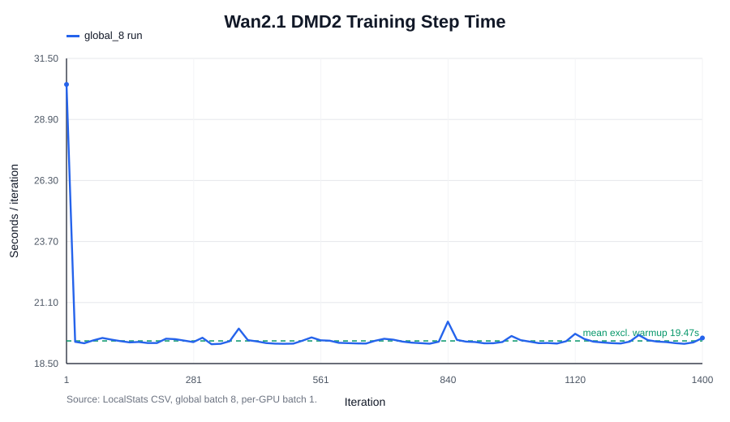
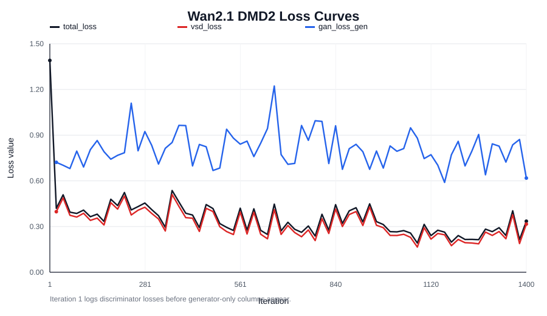
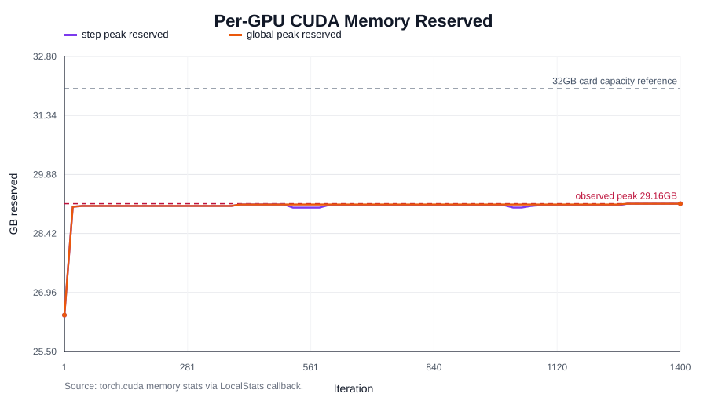

# Wan2.1 DMD2/OpenVid 蒸馏周报

## 基本信息

- **姓名：** 陈庆展
- **日期：** 2026-06-08

---

## 1. 研究领域

本周继续围绕 **视频生成模型的快速采样与蒸馏** 展开，具体对象是 FastGen 框架下的 Wan2.1 T2V 1.3B、OpenVid-1M WebDataset 数据入口，以及 DMD2（Improved Distribution Matching Distillation）训练流程。

当前工作重点不是单纯追求更长训练，而是先把底层实验链路修正到可信状态：教师模型加载、数据入口、checkpoint 保存、日志观测、显存边界和推理入口都需要闭环。只有这个基础稳定后，后续比较 DMD2、f-Distill、Self-Forcing、LADD 或 consistency-style 方法才有意义。

## 2. 领域核心问题

视频扩散模型质量高，但推理步数多、训练/蒸馏显存压力大，导致实验成本高。DMD/DMD2 这类方法的目标是把多步 teacher 的分布能力压缩到少步甚至一步 student 中，但在视频模型上会额外遇到几个实际问题：

1. **工程变量会掩盖方法效果。** 如果 teacher 路径、VAE/text encoder/scheduler 加载、数据入口或日志回调有问题，最终视频效果差不能直接说明 DMD2 方法本身失败。
2. **显存边界非常紧。** Wan2.1 T2V 1.3B 在 32GB 每卡负载下必须严格控制 batch、FSDP、offload 和推理模式，否则容易 OOM 或速度严重下降。
3. **观测体系必须轻量。** 默认 W&B 视频采样/媒体日志会拖慢 smoke test，之前一次 sample encoding 阶段耗时约 3843 秒，导致训练进度判断失真。

因此，本周的核心问题可以概括为：**先建立一个可复现、可监控、可在 32GB 显存边界内运行的 Wan2.1 DMD2 基线，再用该基线重测前期效果不稳定的方法。**

## 3. 技术方案

本周采用的技术路线是“先纠偏，再重测”：

- **统一本地 teacher 接口。** 修正 Wan 网络加载逻辑，使 scheduler、text encoder、VAE 等组件一致从本地 Diffusers teacher 路径读取，避免某些子模块意外回退到远程或错误路径。
- **保留轻量观测，关闭重媒体日志。** 默认 W&B 视频/sample logging 不再进入 smoke/full training；新增本地 `LocalStats` CSV/JSONL 记录 scalar loss、step time、CPU RSS、CUDA allocated/reserved peak。
- **用 FSDP 找到 32GB 边界。** 对比 CPU offload 与 no-offload，最终采用 FSDP + no CPU offload + per-GPU batch=1。该配置在 8 卡上可完整跑 OpenVid DMD2，单卡分片峰值 reserved 约 `29.16GB`，说明 32GB 级别显卡可承载 batch=1 的训练/验证边界。
- **对齐推理入口。** 准备基于 `scripts/inference/video_model_inference.py` 的 student-only 推理脚本和 prompt 文件，使用 `0001000` checkpoint 前缀做推理验证。

输出目录规则也已明确：FastGen 会把实验输出放到 `$FASTGEN_OUTPUT_ROOT/{project}/{group}/{name}/`。例如本周完整训练的 `log_config.name=wan21_t2v_dmd2_OpenVid_global_8`，对应日志路径为：

```text
/data/chenqingzhan/FastGen/FASTGEN_OUTPUT/fastgen/wan_dmd2/wan21_t2v_dmd2_OpenVid_global_8/logs/train_stats.csv
```

## 4. 本周工作

- [x] **优化 Wan2.1 本地 teacher 加载接口。** 修正 `fastgen/networks/Wan/network.py` 中 scheduler/text encoder/VAE 的加载来源，使其统一使用 `self.model_id_or_local_path`，避免本地 Diffusers teacher 目录没有被所有组件一致使用。

- [x] **定位并绕开 W&B media logging 卡顿问题。** 之前 smoke run 在 iteration 1 后进入 `wandb: Encoding video...`，媒体编码耗时约 3843 秒。当前 smoke/full training 已移除默认视频/sample logging，只保留必要 scalar/local stats，避免把“日志慢”误判成“训练慢”。

- [x] **新增持久化观测日志。** 添加轻量 `LocalStats` callback，将 loss、step time、CPU RSS、CUDA allocated/reserved 峰值写入 `logs/train_stats.csv` 和 `logs/train_stats.jsonl`。这解决了之前 stdout 未保存、W&B 禁用后 loss 曲线和显存峰值不可追溯的问题。

- [x] **完成 OpenVid DMD2 可训练性验证。** 在 Wan2.1 T2V 1.3B + OpenVid-1M WebDataset 上完成 FSDP 训练配置验证，当前完整 run 记录到 iter `1400`，并已保存 500、1000 checkpoint。训练输出目录为：

```text
/data/chenqingzhan/FastGen/FASTGEN_OUTPUT/fastgen/wan_dmd2/wan21_t2v_dmd2_OpenVid_global_8/
```

- [x] **找到有效显存/速度配置。** CPU offload 阶段曾观察到约 20 分钟/iter 的严重瓶颈，CPU 长期满载而 GPU 利用率低。关闭 CPU offload 后，短 smoke run 平均约 `14.69s/iter`，完整 global_8 run 去掉 warmup 后平均约 `19.47s/iter`，训练速度恢复到可接受范围。

- [x] **明确 32GB 每卡负载边界。** per-GPU batch=1 可稳定训练，reserved peak 约 `29.16GB`；batch=2 已测试会 OOM。因此目前结论是：32GB 卡适合 student-only 推理、batch=1 smoke/验证；不适合直接把 batch 提到 2。

- [x] **准备 1000 checkpoint 推理入口。** 新增 prompt 文件和基于 `video_model_inference.py` 的推理脚本，推理使用 `--do_student_sampling True --do_teacher_sampling False`。当前服务器上一次推理失败的直接原因是 CUDA/driver 初始化异常，而不是 checkpoint 无法加载；日志中已经出现 `Loading successfully checkpoint 1000`。

## 5. 结论与发现

1. **前期效果差可能不是方法本身差，而是实验链路存在混杂 bug。** teacher 加载路径不一致、W&B media logging 卡顿、CPU offload 导致 GPU 空转等问题都会污染实验结论。现在这些弯路已经基本被定位并修正，说明前期结果需要谨慎解读，不能简单归因到某一个蒸馏方法失败。

2. **DMD2 在 Wan2.1/OpenVid 上已经具备可复现实验基础。** 当前配置可以完整进入训练循环，能保存 checkpoint，能持久化 loss/显存/速度日志，也能加载 1000 checkpoint 进入推理流程。这意味着代码框架已经完成到“可支撑后续验证”的阶段，不需要继续把主要时间消耗在工程排错上。

3. **32GB 显存是可用但紧张的边界。** 当前 per-GPU batch=1 的峰值约 `29.16GB`，离 32GB 只剩约 `2.84GB` 名义余量。后续实验应以 batch=1 的 sanity check 和必要推理验证为主，不在当前阶段投入过多时间做大规模方法横向对比。

4. **下一阶段的主要瓶颈从“能不能跑”转向“研究问题是否值得做”。** FastGen/Wan2.1 基线已经把工程风险降到可控范围；下周更重要的是通过科研 agent 高效率阅读论文，系统寻找 insight、motivation 和痛点，明确后续真正值得投入算力的研究方向。

## 6. 下周计划

- [ ] **构建科研 agent 作为下周主线。** 目标是完成一个能辅助快速调研的工作流：自动收集论文、提取核心问题、总结 method、标注 limitation、归纳 motivation，并把结果组织成可复用的调研表。
- [ ] **建立高效率论文浏览模板。** 每篇论文统一抽取：研究痛点、核心假设、技术路线、实验证据、失败边界、可复现成本、与本课题的潜在连接点，避免只做摘要式阅读。
- [ ] **围绕视频生成加速/蒸馏做第一轮系统调研。** 优先覆盖 DMD/DMD2、LCM/consistency、Self-Forcing、LADD、CausVid、Wan/CogVideoX/Cosmos 等方向，目标不是马上复现实验，而是找出 3-5 个可形成课题 motivation 的真实痛点。
- [ ] **将 FastGen 代码框架优先级下调。** 当前工程链路已经能支撑验证，所以下周只保留必要的 checkpoint 推理 sanity check，不在当前阶段花大量时间做方法横向对比。
- [ ] **在 AutoDL 5090 32G 上完成 1000 checkpoint 推理验证。** 这项作为工程支线：确认 student-only inference 是否能正常出视频，并为后续需要时提供定性样例。

---

## 附录 A：本周实验图表

### A.1 训练速度



说明：完整 global_8 run 的首个 iteration 包含初始化/warmup，稳定阶段平均约 `19.47s/iter`。短 smoke run 在 no-offload 后约 `14.69s/iter`。

### A.2 Loss 曲线



说明：iteration 1 主要记录 discriminator/fake-score 更新，后续记录 generator 侧的 `total_loss`、`vsd_loss`、`gan_loss_gen`。目前这些曲线用于判断训练是否正常推进，不能单独代表最终视频质量。

### A.3 显存曲线



说明：`cuda_step_peak_reserved_gb/max` 和 `cuda_global_peak_reserved_gb/max` 稳定在约 `29.16GB`。这支持“32GB 卡可做 batch=1 验证/推理”的判断，但也说明 batch=2 没有足够余量。

## 附录 B：阅读材料

1. **DMD 原始方法：** *One-step Diffusion with Distribution Matching Distillation*，CVPR 2024。核心思想是让 one-step generator 在分布层面匹配 teacher diffusion，而不是逐轨迹模仿。https://arxiv.org/abs/2311.18828
2. **DMD2 改进方法：** *Improved Distribution Matching Distillation for Fast Image Synthesis*。该工作去掉昂贵 regression dataset，引入 two time-scale update、GAN loss 和多步采样训练修正，是本周实验方法的直接理论来源。https://arxiv.org/abs/2405.14867
3. **Wan 技术报告：** *Wan: Open and Advanced Large-Scale Video Generative Models*。该报告说明 Wan 系列是开放视频基础模型，包含 1.3B/14B 模型、视频 VAE、DiT 和多任务视频生成能力。https://arxiv.org/abs/2503.20314
4. **LCM：** *Latent Consistency Models: Synthesizing High-Resolution Images with Few-Step Inference*。可作为后续 consistency-style 少步生成路线参考。https://arxiv.org/abs/2310.04378
5. **AnimateLCM：** *Computation-Efficient Personalized Style Video Generation without Personalized Video Data*。该工作把 consistency learning 扩展到视频生成加速，对下周探索视频蒸馏路线有参考价值。https://arxiv.org/abs/2402.00769

## 附录 C：科研 agent 调研工作流草案

下周调研工作的重点不是“读更多论文”本身，而是让每篇论文都能沉淀成可比较的研究信息。计划把科研 agent 的输出统一成下面几类字段：

- **Problem / Pain Point：** 论文真正想解决什么痛点，痛点是否仍然存在于视频生成或蒸馏任务中。
- **Motivation：** 作者为什么认为这个问题值得做，是否能迁移成我们自己的研究动机。
- **Method Core：** 方法最小核心是什么，哪些设计是必要的，哪些只是工程细节。
- **Evidence：** 实验证据是否支撑 claim，指标是否充分，是否有视频任务上的缺口。
- **Limitation：** 方法失败边界、算力成本、数据依赖、训练不稳定点。
- **Opportunity：** 能否和 Wan2.1/OpenVid/FastGen 当前基线结合，形成新的实验方向。

第一阶段 agent 不追求复杂自动化，先追求稳定输出：输入论文链接或 PDF，输出结构化笔记和横向对比表。这样可以更快找到 insight 和 motivation，而不是继续在尚未明确问题价值时消耗大量时间做训练对比。

## 附录 D：AutoDL 5090 32G 推理步骤

下面步骤按“从空机器开始”写，重点是先确认 5090 被 PyTorch 正确识别，再安装 FastGen。

### D.1 租机器与基础检查

优先选择：Ubuntu 22.04/24.04、较新的 NVIDIA driver、RTX 5090 32G。开机后先执行：

```bash
nvidia-smi
python3 --version
```

如果 `nvidia-smi` 看不到 5090，先不要装 Python 包，直接换镜像或重启实例。

### D.2 创建 conda 环境

```bash
conda create -n fastgen python=3.12.3 -y
conda activate fastgen
python -m pip install -U pip setuptools wheel
```

### D.3 安装支持 5090 的 PyTorch

5090 是 Blackwell 架构，需要支持 `sm_120` 的 PyTorch wheel。优先按 PyTorch 官网 selector 选择 Linux / pip / CUDA 12.8 或更新版本；如果 selector 给的是 CUDA 12.8，可以用：

```bash
pip install torch torchvision torchaudio --index-url https://download.pytorch.org/whl/cu128
```

安装后必须验证：

```bash
python - <<'PY'
import torch
print('torch:', torch.__version__)
print('cuda runtime:', torch.version.cuda)
print('cuda available:', torch.cuda.is_available())
print('gpu:', torch.cuda.get_device_name(0))
print('capability:', torch.cuda.get_device_capability(0))
PY
```

预期至少满足：`cuda available: True`，GPU 名称包含 `RTX 5090`，capability 接近 `(12, 0)`。如果这里失败，后面 FastGen 一定会失败。

### D.4 安装 FastGen 依赖

把本周修正后的 FastGen 代码放到 AutoDL，例如解压或 git clone 后进入目录：

```bash
cd /root/FastGen
python -m pip install -e . --no-deps
grep -v '^torch' requirements.txt > /tmp/fastgen_requirements_no_torch.txt
python -m pip install -r /tmp/fastgen_requirements_no_torch.txt
```

这里故意跳过 `requirements.txt` 里的 torch，是为了避免 pip 把刚装好的 5090-compatible PyTorch 换成不兼容版本。

### D.5 放置 teacher、checkpoint 和 prompts

建议保持服务器上的相同目录结构，减少路径改动：

```text
/root/FastGen/FASTGEN_OUTPUT/MODEL/Wan-AI/Wan2.1-T2V-1.3B-Diffusers/
/root/FastGen/FASTGEN_OUTPUT/fastgen/wan_dmd2/wan21_t2v_dmd2_OpenVid_global_8/checkpoints/0001000.pth
/root/FastGen/FASTGEN_OUTPUT/fastgen/wan_dmd2/wan21_t2v_dmd2_OpenVid_global_8/checkpoints/0001000.net_model/
/root/FastGen/scripts/inference/prompts/wan21_dmd2_openvid_eval_prompts.txt
```

纯 student 推理先只拷 `0001000.pth` 和 `0001000.net_model/`。如果之后改成恢复训练或继续 DMD2 更新，才需要额外拷 optimizer、fake_score、discriminator 相关目录。

### D.6 运行 student-only 推理

```bash
cd /root/FastGen
conda activate fastgen
export CUDA_VISIBLE_DEVICES=0
export FASTGEN_OUTPUT_ROOT=FASTGEN_OUTPUT
export PYTHONPATH=/root/FastGen:$PYTHONPATH
export PYTORCH_CUDA_ALLOC_CONF=expandable_segments:True

bash fastgen/configs/experiments/WanT2V/run_infer_dmd2_1000.sh
```

如果 AutoDL 的路径不是 `/root/FastGen`，先打开脚本，把 `REPO_ROOT=/root/FastGen` 改成实际路径。推理成功后，视频会写入：

```text
FASTGEN_OUTPUT/fastgen/wan_dmd2/wan21_t2v_dmd2_OpenVid_global_8/inference/0001000_student/
```

### D.7 常见错误判断

- `CUDA unknown error`：优先检查 `nvidia-smi` 和 `torch.cuda.is_available()`，通常是驱动/GPU 状态或 PyTorch CUDA wheel 问题。
- `sm_120 is not compatible`：PyTorch 装错了，需要换 CUDA 12.8 或更新的 wheel。
- checkpoint 找不到：确认 `--ckpt_path` 给的是不带后缀的前缀 `.../checkpoints/0001000`，并且旁边存在 `0001000.net_model/`。
- OOM：先确认是 student-only、`--do_teacher_sampling False`、batch=1，再考虑降低分辨率/帧数。
