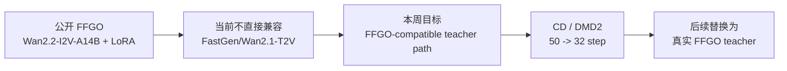
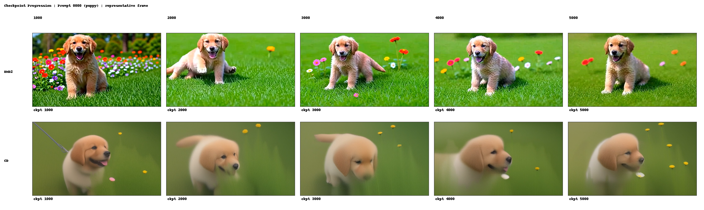
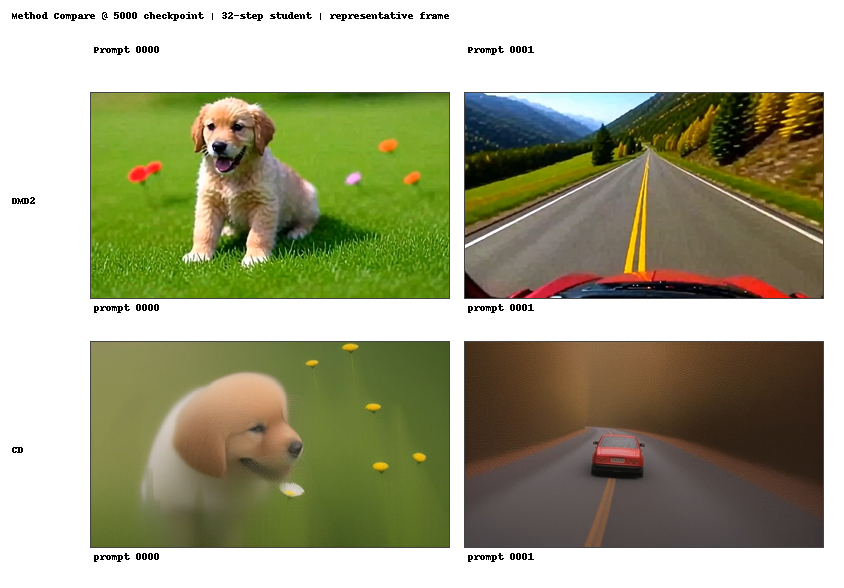
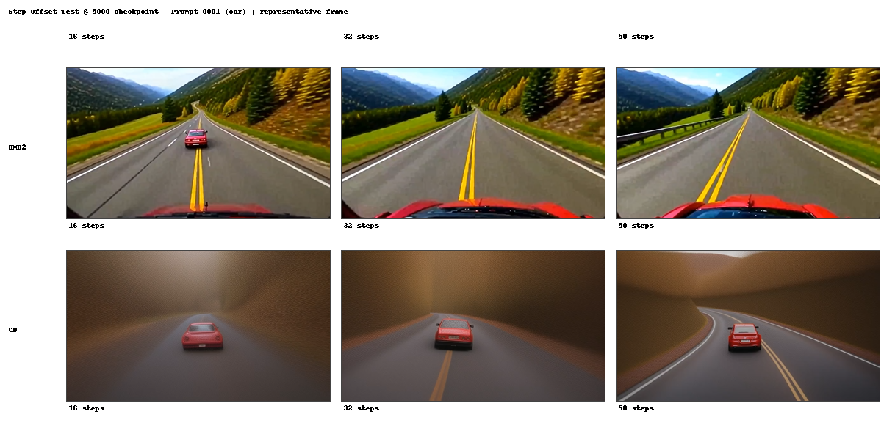

# FFGO 蒸馏前置实验汇报

## 一句话总结

本周的核心价值不是证明 FFGO 已经蒸馏成功，而是把 **FFGO 之外的通用蒸馏基础设施** 跑通了，并且进一步确认 `FastGen` 对 `Wan2.2 TI2V 5B` 其实有原生支持：我先明确了公开 FFGO 和当前主链的不兼容点，再用 placeholder teacher 完成了 `CD` 和 `DMD2` 的 `50 -> 32` 蒸馏闭环，最后补做了 `16 / 32 / 50` 的 step-offset 推理测试，拿到了后续接真实 FFGO teacher 所需要的训练预算、推理样例和对比资产。

## 汇报主线

建议按下面三段讲：

1. **先说明这周为什么做的是“前置实验”**
2. **再讲训练闭环和资源预算已经跑通**
3. **最后讲我已经拿到了可以继续分析的推理样例**

---

## 1. 工作一：FFGO 调研与问题定义

### 我做了什么

- 调研了公开 FFGO 的结构和实现方式。
- 明确了公开 FFGO 不是 FastGen 原生 teacher，而是更接近：
  - `Wan2.2-I2V-A14B`
  - `LoRA adapter`
  - `I2V / first-frame customization`
- 对照服务器上当前稳定的蒸馏主链，发现现有 FastGen 实验更接近：
  - `Wan2.1-T2V-1.3B`
  - 全参数 student
  - `CD / DMD2` 少步蒸馏

### 这项工作的结论

- FFGO 和当前 `FastGen/Wan2.1` 主链 **不天然兼容**。
- 但本周复查服务器代码后，确认 `FastGen` 已经原生包含：
  - `WanI2V`
  - `Wan22_I2V_5B_Config`
  - `WanI2V/config_dmd2_wan22_5b.py`
  - `WanI2V/config_sft_wan22_5b.py`
- 所以下一步不应该直接从零自建 `Wan2.2 I2V` 支持，而应该先基于现成原生框架验证。
- 这样下周如果接入真实 FFGO teacher 失败，就能知道问题主要在 teacher 接口，而不是蒸馏框架本身。

### 我建议这样说

> 这周我先把 FFGO 结构梳理清楚了。公开 FFGO 更像是 `Wan2.2-I2V-A14B + LoRA` 的视频定制方法，不是 FastGen 原生 teacher；但我进一步复查了服务器代码，发现 FastGen 对 `Wan2.2 TI2V 5B` 本身已经有原生 `WanI2V` 和 `DMD2/SFT` 配置。所以这周的结论不是“FastGen 完全不支持 Wan2.2 I2V”，而是“FFGO 不开箱即用，但我下周可以先基于现成 `Wan2.2 TI2V 5B` 框架做测试”。 

### 结构示意

---

## 2. 工作二：蒸馏训练闭环与资源预算

### 我做了什么

- 在服务器上打通了 `FFGO-compatible teacher path -> FastGen distillation -> Wan2.1 1.3B student` 的闭环。
- 具体完成了两条正式实验：
  - `DMD2 32-step / 5000 iter / every 500 ckpt`
  - `CD 32-step / 5000 iter / every 500 ckpt`
- 产出了完整 checkpoint：
  - `0001000`
  - `0002000`
  - `0003000`
  - `0004000`
  - `0005000`

### 这项工作的结果

| 方法 | 训练设置 | 总时长 | 峰值显存/卡 | 结果 |
| --- | --- | --- | --- | --- |
| `DMD2` | `32-step, 5000 iter, 4-GPU FSDP` | 约 `23h 25m` | `29.85GB` | 完成并保存 `1000~5000` ckpt |
| `CD` | `32-step, 5000 iter, 2-GPU FSDP` | 约 `21h 36m` | `29.10GB` | 完成并保存 `1000~5000` ckpt |

### 这项工作的价值

- 这说明我现在已经不在“搭环境”阶段，而是拿到了一条 **可重复执行的蒸馏流水线**。
- 我已经知道：
  - 一轮实验要多久
  - 显存大概需要多少
  - checkpoint 怎么保存
  - 推理怎么回放

### Checkpoint 走势

下面这张图是 `prompt 0000 (puppy)` 的代表帧，对比 `1000 -> 5000` checkpoint 的变化趋势。

### 5000 checkpoint 的方法对比

下面这张图是 `5000 checkpoint` 下，`DMD2` 和 `CD` 在两个 prompt 上的代表帧。

### 我建议这样说

> 这周第二个结果是，我已经把蒸馏训练闭环真正跑通了。`CD` 和 `DMD2` 两条正式 run 都完成了 `5000 iter`，并且每 `500 iter` 正常保存 checkpoint。现在最有价值的不只是“能跑”，而是我拿到了真实的资源预算：`DMD2` 一轮大约 23 个半小时，`CD` 一轮大约 21 个半小时，峰值显存都接近单卡 30GB。这说明后面如果接 FFGO teacher，我已经知道实验成本和执行节奏。

### 原始视频入口

- [DMD2 5000 / prompt 0000](../../artifacts/inference_videos/2026-04-20/dmd2/0005000/eval_2prompts/student_step32_0000_seed42.mp4)
- [DMD2 5000 / prompt 0001](../../artifacts/inference_videos/2026-04-20/dmd2/0005000/eval_2prompts/student_step32_0001_seed42.mp4)
- [CD 5000 / prompt 0000](../../artifacts/inference_videos/2026-04-20/cd/0005000/eval_2prompts/student_step32_0000_seed42.mp4)
- [CD 5000 / prompt 0001](../../artifacts/inference_videos/2026-04-20/cd/0005000/eval_2prompts/student_step32_0001_seed42.mp4)

---

## 3. 工作三：step-offset 推理测试

### 我做了什么

- 基于 `0005000` checkpoint，补做了 `16 / 32 / 50` 的 step-offset 推理测试。
- 两个方法都测了：
  - `DMD2`
  - `CD`

### 这项工作的结果

- 两条方法都可以在 `16 / 32 / 50` 下正常推理。
- 也就是说，`32-step` 训练出来的 checkpoint **不是文件格式上只能跑 32-step**。
- 但这不等于说它已经“同样适合 16-step 或 50-step”，所以这里的意义是：
  - 先验证步数偏移下的 **可运行性**
  - 给后续 progressive distillation 提供基线

### 推理时间

| 方法 | 16 steps | 32 steps | 50 steps |
| --- | --- | --- | --- |
| `DMD2` | `27.3s / 视频` | `54.6s / 视频` | `85.3s / 视频` |
| `CD` | `26.0s / 视频` | `52.1s / 视频` | `81.5s / 视频` |

### 步数偏移可视化

下面这张图是 `5000 checkpoint`、`prompt 0001 (car)` 下的代表帧，对比 `16 / 32 / 50` 三种步数。

### 我建议这样说

> 第三个结果是，我补做了 `16 / 32 / 50` 的 step-offset 推理测试。这个测试的价值不在于现在就得出“16步更好”或者“50步更好”，而是验证当前 `32-step checkpoint` 在步数偏移下是可运行的，并且推理时间基本随步数线性变化。这样我后面做 progressive distillation 或者做步数策略选择时，就不是从零开始。

### 原始视频入口

- [DMD2 / 16-step / prompt 0001](../../artifacts/inference_videos/2026-04-20/step_offset/ffgo_inference_step_offset/dmd2/step16/eval_2prompts/student_step16_0001_seed42.mp4)
- [DMD2 / 32-step / prompt 0001](../../artifacts/inference_videos/2026-04-20/step_offset/ffgo_inference_step_offset/dmd2/step32/eval_2prompts/student_step32_0001_seed42.mp4)
- [DMD2 / 50-step / prompt 0001](../../artifacts/inference_videos/2026-04-20/step_offset/ffgo_inference_step_offset/dmd2/step50/eval_2prompts/student_step50_0001_seed42.mp4)
- [CD / 16-step / prompt 0001](../../artifacts/inference_videos/2026-04-20/step_offset/ffgo_inference_step_offset/cd/step16/eval_2prompts/student_step16_0001_seed42.mp4)
- [CD / 32-step / prompt 0001](../../artifacts/inference_videos/2026-04-20/step_offset/ffgo_inference_step_offset/cd/step32/eval_2prompts/student_step32_0001_seed42.mp4)
- [CD / 50-step / prompt 0001](../../artifacts/inference_videos/2026-04-20/step_offset/ffgo_inference_step_offset/cd/step50/eval_2prompts/student_step50_0001_seed42.mp4)

---

## 4. 未来期望：如何把 FFGO 整合进我们的框架

### 未来目标

我希望后续不是长期停留在 placeholder teacher，而是把真实 FFGO teacher 逐步整合进当前已经验证过的 FastGen 蒸馏闭环里。但从这周的新发现看，下一步不应该直接跳到 FFGO teacher 接入，而应该先验证现成 `Wan2.2 TI2V 5B` 原生框架。最终希望做到：

- 先确认 `FastGen` 现成 `Wan2.2 TI2V 5B` 原生框架在本机环境下可直接复用；
- teacher 侧可以稳定加载 FFGO；
- student 侧可以继续沿用当前的少步蒸馏训练流程；
- `50 -> 32` 先成立，再决定是否继续往 `16 / 8 / 4` 走；
- 最后形成一条“FFGO teacher -> FastGen distillation -> 少步 student”的可复现路线。

### 我认为最现实的整合路线

#### 路线 0：先测试现成 `Wan2.2 TI2V 5B` 原生框架

这是这周更新后的第一优先级。

- 先利用 FastGen 已有的：
  - `WanI2V`
  - `Wan22_I2V_5B_Config`
  - `config_dmd2_wan22_5b.py`
  - I2V 推理入口
- 先验证：
  - 这条原生 `Wan2.2 TI2V` 路线在当前服务器环境下能不能直接跑；
  - 它能不能作为后续 FFGO 整合前的 I2V 蒸馏基线。

这条路线的好处是：

- 不用从零扩展 `Wan2.2`；
- 风险更低；
- 能更快判断 FastGen 对 I2V 蒸馏到底支持到什么程度。

#### 路线 A：内部 FFGO 能整理成 `Wan2.1-compatible merged teacher`

这是最低风险、我最希望走的方案。

- 直接把当前的 placeholder teacher 替换成真实 merged FFGO teacher；
- 尽量不改：
  - `DMD2 / CD` 方法；
  - `32-step student`；
  - 当前已经稳定的训练和推理脚本；
- 先回答最核心的问题：
  - 真实 FFGO teacher 的能力能不能在当前 FastGen 框架下被蒸到 student 中。

这条路线的好处是：

- 改动最小；
- 变量最少；
- 最快能得到“FFGO 是否值得继续蒸馏”的结论。

#### 路线 B：FFGO 保持公开 `Wan2.2-I2V-A14B + LoRA` 形态

如果只能走公开 FFGO 路线，那就不是简单换一个权重路径，而是需要把 FFGO 的 teacher 接入层补完整。

需要改的模块主要有：

1. **teacher 加载**
   - 支持 `LoRA adapter` 或 merged weights；
   - 对齐到 FastGen 已有 `Wan2.2 I2V/TI2V` config 和初始化逻辑。

2. **数据与条件输入**
   - 当前 FastGen 主链更接近 `T2V(mp4 + txt)`；
   - FFGO 更接近 `I2V / first-frame customization`；
   - 所以后面要补：
     - `first frame`
     - `reference image`
     - 可能的 `prompt phrase`
     - 如果进入编辑任务，还包括 `source video / mask`

3. **teacher-student 对齐**
   - 如果 teacher 和 student 不再是同一模型族，就不能假设现在的对齐关系还能直接成立；
   - 到时要么换 compatible student backbone，要么补跨架构蒸馏对齐逻辑。

### 我对阶段推进的预期

我希望后续按下面的顺序推进，而不是一次性把所有变量压上去：

1. **Stage A**
   - 先确认现成 `Wan2.2 TI2V 5B` 原生框架可用；
   - 判断现成 `WanI2V` 路线能否改到更接近 `50 -> 32` 的实验设定。

2. **Stage B**
   - 再确认真实 FFGO teacher 单独推理可用；
   - 明确 teacher 需要哪些输入。

3. **Stage C**
   - teacher 能被 FastGen teacher side 正常调用；
   - 不要求马上效果好，先要求接口稳定。

4. **Stage D**
   - 继续做 `50 -> 32` 的 smoke run；
   - 先看能不能正常训练、存 ckpt、做推理。

5. **Stage E**
   - 再做 `5000 iter / 500 ckpt` 的正式 run；
   - 拿到可比较的 checkpoint 和推理资产。

6. **Stage F**
   - 如果真实 FFGO teacher 接入成功，再决定是否继续做：
     - `32 -> 16`
     - `16 -> 8`
     - `8 -> 4`

### 我建议这样说

> 我对后面的预期不是简单把 FFGO 放进来试一下，而是希望逐步把 FFGO 整合成当前 FastGen 蒸馏框架里可复现的 teacher。现在的新发现是，FastGen 对 `Wan2.2 TI2V 5B` 本身已经有原生支持，所以我下周会先基于现成 `WanI2V` 路线做测试；如果这条原生 I2V 路线稳定，再决定是走低风险的 merged teacher 替换，还是继续补公开 `FFGO A14B + LoRA` 的 teacher 接入层。无论走哪条路线，我都希望最终形成一条稳定的 `FFGO teacher -> FastGen distillation -> 少步 student` 路线。 

---

## 5. 这周我能汇报的价值

### 我可以明确 claim 的

- 我已经把 **FFGO 前面的通用蒸馏基础设施** 跑通了。
- 我已经拿到了真实训练预算：
  - 时间
  - 显存
  - checkpoint 产物
  - 推理回放方式
- 我已经有一组后续可以持续扩展的对比资产：
  - checkpoint progression
  - method comparison
  - step-offset comparison

### 我不应该过度 claim 的

- 还不能说“FFGO 能力已经成功蒸馏”
- 还不能说“DMD2 或 CD 已经在业务效果上胜出”
- 还不能说“32-step checkpoint 天然适合任意步数”

---

## 6. 下一步

1. 先基于现成 `WanI2V/config_dmd2_wan22_5b.py`，测试 `FastGen` 原生 `Wan2.2 TI2V 5B` 路线在当前环境下能否直接运行。
2. 如果原生 `Wan2.2 TI2V` 路线稳定，再评估它能否改造成更接近 `50 -> 32` 的实验设定，并作为后续 FFGO 整合前的 I2V 蒸馏基线。
3. 只有在现成原生路线确认可用后，再评估公开 `FFGO A14B + LoRA` 需要补哪些接入层。
4. 基于现有 `DMD2/CD` 结果，继续做主观比较，判断哪个方法更值得保留。
5. 结合 `16 / 32 / 50` step-offset 结果，决定是否开始真正的 progressive distillation。

---

## 7. 1 分钟口播版

> 这周我主要做了三件事。第一，我先把公开 FFGO 的结构梳理清楚了，确认它本质上是 `Wan2.2-I2V-A14B + LoRA` 的视频定制方法；同时我进一步复查了服务器上的 FastGen 代码，确认 FastGen 对 `Wan2.2 TI2V 5B` 本身已经有原生 `WanI2V` 和 `DMD2/SFT` 配置，所以问题不是“FastGen 完全不支持 Wan2.2 I2V”，而是“FFGO 这个 teacher 形态还不能直接开箱即用”。第二，我已经把当前 `CD` 和 `DMD2` 的蒸馏训练闭环跑通了，拿到了 checkpoint 和真实资源预算。第三，我补做了 `16 / 32 / 50` 的 step-offset 推理测试，为后面做 progressive distillation 提供了基线。所以下周更合理的任务，不是从零自建 `Wan2.2` 支持，也不是马上硬接 FFGO teacher，而是先基于现成 `Wan2.2 TI2V 5B` 框架做测试，再决定如何把 FFGO 真正整合进来。 
